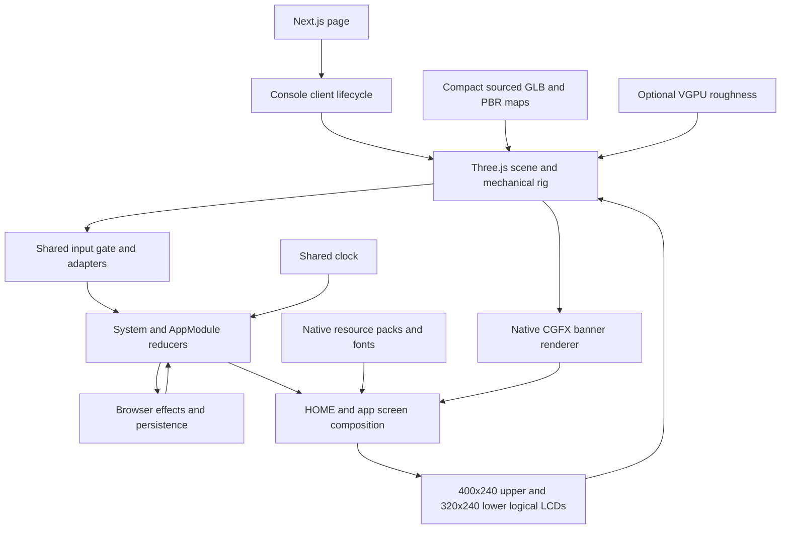

# Application architecture

The portfolio runs inside the two screens of a sourced original Silver + Black
3DS XL. Next.js serves the page and static delivery assets; the browser owns the
interactive console. There is no application backend or firmware executable in
the runtime. Native resources are converted offline and interpreted by browser
renderers around deterministic software state.

This design map describes integration **`1be4133` (24 September 2026)**. Read
[GOAL](../../GOAL.md) for acceptance, [current scope](../portfolio-ui-scope.md)
for exclusions/worker ownership and [progress](../progress-2026-09-24.md) for
what has actually been verified. Later worker commits are outside this checkpoint.
Repository instructions live only in [AGENTS.md](../../AGENTS.md); this directory
explains the design and its tradeoffs.

## System map

The upper logical surface expands to 800×240 texture storage; the physical
panel remains 5:3. Three.js dependencies stay in `src/scene/`. The OS receives
injected banner drawing callbacks and never navigates scene objects.

## Design documents

| Area | Document | Main implementation |
| --- | --- | --- |
| Startup, ownership, teardown | [Runtime composition](runtime-composition.md) | `Console.tsx`, `console-scene.ts`, `runtime-effects.ts` |
| Hardware, LCDs, native banners | [Scene and rendering](scene-and-rendering.md) | `src/scene/` |
| Input, application lifecycle, views | [OS state and input](os-state-and-input.md) | `src/os/system.ts`, `app-host.ts`, `screens.ts` |
| Offline conversion, delivery, provenance | [Assets and materials](assets-and-materials.md) | `scripts/firmware/`, `public/os/firmware/` |
| Visual/interaction/accessibility contract | [Experience design](experience-design.md) | `Console.tsx`, screen painters |
| Quality, cache, loading, failure | [Performance and resilience](performance-and-resilience.md) | quality tiers, native sessions and renderers |
| Checks and evidence | [Verification](verification.md) | `tests/`, verification scripts, SSD records |
| Future changes with rationale | [Proposed improvements](proposed-improvements.md) | No runtime changes in this documentation task |

## Boundaries that matter

React starts and stops one imperative scene; it does not mirror frame-by-frame OS
state. The scene translates browser input and mechanics into software events.
Reducers decide state and emit effects; effect owners perform browser operations.
Presentation derives pixels from state and owns resources without putting Canvas,
audio or GPU handles in saves. Source conversion is separate from public delivery:
a decoded resource may remain unsupported, unpublished or unused by a live view.

The progress matrix distinguishes those stages. A source trace establishes only
the code/resource fact it traces; a screenshot establishes only its captured
scenario. Neither replaces matched native visual, motion and audio comparisons.
