# Asset, firmware and material architecture

Editable sources, private extraction, converted delivery and runtime ownership
are separate layers. A resource can decode successfully without being published,
supported by the renderer, used by a live screen or visually accepted.

## Hardware pipeline

```text
licensed Joshua P. model
  -> sequential Blender refinement checkpoints
  -> model/candidates/joshua-xl/silver-audio-finish.blend
  -> full-resolution validation GLB and maps
  -> scripts/compress-delivery.mjs
  -> public/models/candidates/joshua-xl.glb + EUR paint mask
```

The compact GLB carries the base/hinge hierarchy, LCD/control metadata, UVs,
tangents, PBR maps and paint roles. Renaming nodes, flattening hierarchy or
losing attributes can break mechanics and materials even when Blender still
looks plausible. Follow the [model validation index](../model-validation-index.md)
and preserve earlier checkpoints and attribution.

Embedded maps are the complete fallback. VGPU generates bounded silver
roughness variation once; `source-paint-surface.ts` applies it only through
exported roles and masks. A browser without WebGPU must retain silver paint,
dark plastic, rubber, glass, legends, lenses and indicators.

## Firmware source-to-delivery flow

```mermaid
flowchart LR
  CIA[Private decrypted CIAs] --> Verify[Identity, plaintext and hash checks]
  Verify --> Extract[CTRTool private extraction]
  Extract --> Decode[Layouts, textures, fonts, messages, models and audio]
  Decode --> Private[Private converted candidates and reports]
  Private --> Publish[Explicit title and pack allowlist]
  Publish --> Public[Versioned public manifest and selected resources]
  Public --> Load[Validated lazy browser loaders]
  Load --> Render[Canvas, Three.js and audio owners]
```



`scripts/firmware/build.py` verifies title/content identity before extracting
known formats. Converter and publisher records include script/tool and source
hashes. `scripts/firmware/stock_ui.py` adds selected title packs while preserving
HOME/shared provenance. `audit.py` validates public records and can compare an
independent rebuild. Full packages, executables, tickets, credentials and
absolute private paths never enter public delivery.

The schema-1 manifest at `public/os/firmware/10.7.0-32E/manifest.json` is the
URL/provenance authority. At this checkpoint it identifies EUR 10.7.0-32E,
EU English, 25 titles and 1,553 resources. It records exclusions and unsupported
inputs instead of generating substitutes. Title loaders require manifest
membership, exact title/pack identity, requested layouts/animations, valid
texture metadata and exact font bindings.

## Runtime resource boundaries

HOME resources and shared fonts have console-session lifetime. Stock title
packs are lazy and scoped to one foreground owner/view through
`createNativeTitleSession`. Requests are snapshotted and generation-fenced;
replacement aborts pending work and disposes late completions. Owned title fonts
are released with the result; shared fonts remain borrowed.

`NativeLayoutRenderer` bounds its raster cache to 8 MiB by default and its pose
cache to 16 entries. Stock presentation bounds decoded media images to 64 and
releases them on owner change. Banner models/targets and HOME audio resources
have scene/audio-owner lifetimes. See [runtime ownership](runtime-composition.md)
and [resilience](performance-and-resilience.md).

Unsupported selected material/layout fields are hard failures that reach paired
screen recovery. Unrequested unsupported resources remain diagnostics and do
not prevent a bounded supported view. This keeps partial format support useful
without presenting it as complete firmware support.

## Provenance and acceptance

Private reports and comparisons belong under the designated SSD root; public
files carry only safe relative provenance. A hash proves source identity. A
converter test proves its bounded contract. A real-resource render proves that
the renderer consumes that selection. Browser inspection proves one integrated
scenario. Matched native evidence is still required for visual, motion and audio
fidelity. See [verification](verification.md) and the
[progress matrix](../progress-2026-09-24.md).
