# Asset, firmware and material architecture

Editable sources, private extraction, converted delivery and runtime ownership
are separate layers. A resource can decode successfully without being published,
supported by the renderer, used by a live screen or visually accepted.

HOME `LncBase_D_01/P_Memo_10` omits the UV1 attribute selected by its third
sampler. Runtime `79597372` gates an inferred all-zero sampling adaptation by
the exact material, sampler, UV count, generator pattern and texture names.
Authored UVs are unchanged; every other missing selected UV fails explicitly.
The dump establishes the omission, not native initialization. Decrypted
textures, palette and TEV remain unchanged. See the
[source and sampling contract](../home-notes-toolbar-raster-2026-10-02.md).

Power `Slp_U_00/T_Btm_00` explicitly selects writer `0x111`: float32 measured
block and per-line centering, glyph advance and endpoints. Only this pane opts
into direct LCD alpha sampling, requiring upright unit-scale integer-sized
transforms and no color spans. The exact right-edge tie resolves the captured
footer cluster without a fitted offset or replacement graphic. See the
[source and recapture contract](../home-power-footer-raster-2026-10-02.md).

Power `Slp_U_00/T_Main_00` explicitly selects the decoded multiline writer
flags `0x110` origin through `multilineBlockOrigin`. It measures CWDH glyph
bounds and advances with float32 arithmetic before ceil-centering the complete
block; it does not center each row or encode a fitted offset. Default text
callers and the lower LCD sampler remain unchanged. The text descriptor is
part of the raster cache key, and invalid selected shapes fail. See the
[source contract](../home-power-block-centering-2026-10-02.md) and
[production comparison](../home-power-centering-2026-10-02.md).

## Hardware pipeline

```text
licensed Joshua P. model
  -> sequential Blender refinement checkpoints
  -> model/candidates/joshua-xl/silver-audio-finish.blend
  -> full-resolution validation GLB and maps
  -> scripts/compress-delivery.mjs
  -> public/models/candidates/joshua-xl.glb + EUR paint mask
```

The compact GLB carries the base/hinge hierarchy, LCD/control metadata, UVs,
tangents, PBR maps and paint roles. Renaming nodes, flattening hierarchy or
losing attributes can break mechanics and materials even when Blender still
looks plausible. Follow the [model validation index](../model-validation-index.md)
and preserve earlier checkpoints and attribution.

Embedded maps are the complete fallback. VGPU generates bounded silver
roughness variation once; `source-paint-surface.ts` applies it only through
exported roles and masks. A browser without WebGPU must retain silver paint,
dark plastic, rubber, glass, legends, lenses and indicators.

## Firmware source-to-delivery flow

```mermaid
flowchart LR
  CIA[Private decrypted CIAs] --> Verify[Identity, plaintext and hash checks]
  Verify --> Extract[CTRTool private extraction]
  Extract --> Decode[Layouts, textures, fonts, messages, models and audio]
  Decode --> Private[Private converted candidates and reports]
  Private --> Publish[Explicit title and pack allowlist]
  Publish --> Public[Versioned public manifest and selected resources]
  Public --> Load[Validated lazy browser loaders]
  Load --> Render[Canvas, Three.js and audio owners]
```

The pinned EUR 10.7.0-32E dump is the sole source for native UI visuals and
audio. Every visible native element and cue must resolve to a public manifest
record with private dump provenance. A converter output without a manifest
identity cannot be presented as native. Hand-drawn or CSS versions, community
fonts and guessed sounds are not native substitutes. Label portfolio media
and deliberate local/read-only adaptations separately.



`scripts/firmware/build.py` verifies title/content identity before extracting
known formats. Converter and publisher records include script/tool and source
hashes. `scripts/firmware/stock_ui.py` adds selected title packs while preserving
HOME/shared provenance. `--additive` appends new packs without rewriting an
already-delivered title pack whose converted source now hashes differently.
`audit.py` validates public records and can compare an independent rebuild.
Full packages, executables, tickets, credentials and absolute private paths
never enter public delivery.

The schema-1 manifest at `public/os/firmware/10.7.0-32E/manifest.json` is the
URL/provenance authority. At this checkpoint it identifies EUR 10.7.0-32E,
EU English, 25 titles and 1,783 resources. It records exclusions and unsupported
inputs instead of generating substitutes. Title loaders require manifest
membership, exact title/pack identity, requested layouts/animations, valid
texture metadata and exact font bindings.

Compact bitmap-font delivery retains `glyph.sourceSheet` (including fallback)
as the original BCFNT texture-sheet index. `glyph.sheet` and its x/y rectangle
still address the delivered PNG atlas. Native text batching can use the original
identity without undoing atlas compaction; older deliveries omit it and require
a `sourceSheet ?? sheet` fallback. See the [HUD delivery note](../hud-font-source-sheets.md).

## Runtime resource boundaries

Power's lower label opts into existing final-LCD alpha glyph sampling through
an explicit `textSamplingPanes` allowlist. Missing, duplicate or invalid selected
pane names fail the draw; sibling text and other call sites retain their prior
path. No new font, offset or coverage fit is introduced. The attempted upper
multiline sampler was removed after production comparison failed to improve it.
See [Power text sampling](../home-power-glyph-sampling-2026-10-02.md) for the
source scope and [production evidence](../home-power-raster-2026-10-02.md).

HOME resources and shared fonts have console-session lifetime. Stock title
packs are lazy and scoped to one foreground owner/view through
`createNativeTitleSession`. Requests are snapshotted and generation-fenced;
replacement aborts pending work and disposes late completions. Owned title fonts
are released with the result; shared fonts remain borrowed.

`NativeLayoutRenderer` bounds its raster cache to 8 MiB by default and its pose
cache to 16 entries. Stock presentation bounds decoded media images to 64 and
releases them on owner change. Banner models/targets and HOME audio resources
have scene/audio-owner lifetimes. See [runtime ownership](runtime-composition.md)
and [resilience](performance-and-resilience.md).

Unsupported selected material/layout fields are hard failures that reach paired
screen recovery. Unrequested unsupported resources remain diagnostics and do
not prevent a bounded supported view. This keeps partial format support useful
without presenting it as complete firmware support.

## Provenance and acceptance

Private reports and comparisons belong under the designated SSD root; public
files carry only safe relative provenance. A hash proves source identity. A
converter test proves its bounded contract. A real-resource render proves that
the renderer consumes that selection. Browser inspection proves one integrated
scenario. Matched native evidence is still required for visual, motion and audio
fidelity. See [verification](verification.md) and the
[progress matrix](../progress-2026-09-24.md).

At the `8e1e31e` checkpoint, the Sound Span visualizer was a published source
model awaiting a browser mount. `manifest.models.soundSpan` points to
`models/sound-span/model.json`, with one source texture. Both manifest records
map to Sound title `0004001000022500`, content index 0, content ID
`0000000b` and `contents/0000-0000000b/romfs/res/S.pack/S_Vis_Span_U.bcmdl.LZ`
(source SHA-256 `c9558d7c10d0d6354b63aeb39ca173707cdb927d3344f23e51d5229c4b953244`).
Scene-owned visible mounting and native LCD comparison are separate gates.
The model is now mounted in the upper Sound room (`1b6c6c8`). Its Base material
blue (`ccdb686`) and edge/vertical fit (`ca2b3d5`) were fitted from an Azahar
capture, so those parameters are an **explicit visual adaptation** layered on
the source mesh and texture. The latest raw LCD comparison still fails at
15,583 upper / 6,267 lower pixels over 2/255. Source identity and a visible
model do not establish a native match.

Camera browse controls use source `P_BrwsMenu_D` from
`packs/camera/contents/0000-0000001a/lyt-P_Brws_D-arc-LZ.json`, title
`0004001000022400`, content index 0, content ID `0000001a`, source
`lyt/P_Brws_D.arc.LZ` (SHA-256
`ed22962fa35a3019457302e059ddc19709fa07e36ae1d67b506a58e9d317181a`).
The visible Slideshow/Shoot/Settings chrome is source-backed (`c814502`), as
are the restored `P_BrwsBase_D` zoom icons (`b196bc7`) from the same Camera
archive and manifest pack. Shoot and zoom stay inert for the read-only
portfolio gallery. That interaction adaptation does not mask the remaining
gallery pixel and input differences. The latest source-zoom browser/native
diagnostic still fails at 95,350 upper / 26,496 lower pixels over 2/255.

FLYT amiibo material support is capability-bounded: converter 1.5.2 marks the
traced two-texture combinations, while runtime preparation lowers them to the
existing TEV pipeline. A8/A4 sample pixels retain format metadata so FLYT can
apply its source-defined white RGB selector without altering CLYT semantics.
Only the audited centered source-4/option-6 window projection is converted into
per-patch whole-window UVs. Other selected projections remain failures. See the
[material trace](../amiibo-material-command-trace.md); support does not imply
public selection or native visual acceptance.

The read-only amiibo opening selection is now published and consumed through
the existing title session. Its English header uses the executable's named-pane
message binding; the four device operations are inert and Close uses the common
Back path. See the [opening UI evidence](../native-amiibo-opening.md).

### Rotated native LCD pictures

The native CPU renderer samples rotated pictures directly at LCD pixel centres
when their destination is opaque and uses standard source-over blending. The
inverse pane transform feeds original texture/TEV evaluation once, avoiding
Canvas filtering of a pre-rasterized picture. Text, unrotated pictures, other
blends and nonopaque destinations keep the existing path. The LCD-sized scratch
surface is reused and disposed with the renderer. See the [Health raster
comparison and bounded performance evidence](../health-rotated-picture-raster-2026-09-26.md).

Camera guide lower composition now uses its executable's warm render-target
clear and settled black-alpha128 modal pass over the combined CGFX/2D underlay.
The scene retains opaque target readback ownership; the OS applies the modal
before the guide. Source replay and remaining clip/projection/pixel gates are
recorded in [Camera guide modal composition](../camera-guide-modal-composition.md).
