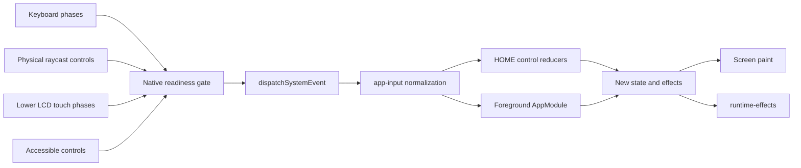

# Software state, input and presentation

The current [UI scope](../portfolio-ui-scope.md) preserves eight portfolio apps
and native stock UI/basic navigation. Software Keyboard and six excluded apps
are unregistered. Camera is a read-only portfolio gallery; Sound is an
owner-scoped favourite-song player. Historical keyboard/device modules remain
research, not active features or acceptance dependencies.

## State and application contracts

[`state.ts`](../../src/os/state.ts) models menu layout, folders and preferences.
[`system.ts`](../../src/os/system.ts) coordinates boot, HOME, launch, application,
power/shutdown, sleep and dialogs. [`app-host.ts`](../../src/os/app-host.ts) owns
application, system-applet and library-applet instances and their callers/results.
[`app-types.ts`](../../src/os/app-types.ts) defines `AppDescriptor`, `AppModule`,
`AppView`, saves and effects. The registry creates portfolio modules first,
followed by stock title descriptors; internal helpers have no invented HOME tiles.

HOME suspends the active owner; launching different software requires the existing
close/switch confirmation. Nested library applets return to their caller. The
Settings helper adapter restores its suspended parent page/selection on helper
Back, while physical HOME suspends the helper. Recursive close removes the tree.
For suspended Game Notes, a second HOME press closes that applet through the
normal lifecycle and keeps its application caller suspended at HOME; see the
[owner correction](../notes-home-owner-exit.md). Other titles retain HOME resume.
This is bounded portfolio navigation, not a complete native APT implementation.
See [helper return tests](../../tests/settings-helper-return.test.mjs).

| Module | Responsibility |
| --- | --- |
| `apps.ts` | Portfolio application and entry data |
| `state.ts` | HOME Menu layout, folders, themes and low-level menu types |
| `system.ts` | Boot, HOME, launch, suspend, app, dialog, power and persistence transitions |
| `layout.ts` | Native screen geometry and hit regions |
| `screens.ts` | HOME Menu and system-panel canvas painting |
| `portfolio-screens.ts` | App icons, banners and application interiors |
| `notes-suspended-capture.ts` | In-memory last complete LCD pair of the application slot, for Game Notes |
| `bitmap-font.ts` | Parsed HOME font metrics and glyph drawing |
| `resources.ts` | Validated optional firmware-derived resource loading |
| `native-chrome.ts` | Authored/cropped native chrome asset loading |
| `audio.ts` | Gesture-unlocked sound decoding and playback |
| `system-transitions.ts`, `native-system-presentation.ts` | Browser boot/launch/shutdown timing and source HOME power/fade rendering |
| `native-keyboard-audio/sequence.ts` | Isolated `common_back` sequence controls, counted native updates and release-tail ownership; transport integration pending |
| `animation.ts` | Layout animation sampling utilities |
| `app-types.ts`, `app-registry.ts`, `app-host.ts` | Firmware contracts, installed titles and applet lifecycle |
| `app-input.ts` | Phase-aware input normalization and shared-clock repeats |
| `home-input-producer.ts` | Native poll/event arithmetic used by the live HOME host |
| `home-input-sample.ts`, `home-input-adapter.ts` | Native independent digital/axis edges and explicit browser pulse adaptation |
| `home-scroll-consumer.ts` | Native direction/focus/mode3 arithmetic and ordered cue, cursor and banner observations |
| `home-navigation-pass.ts` | Pure ordinary input/lower/Loop composition with ordered observations and explicit eligibility; live integration pending |
| `home-cursor-presentation.ts`, `home-primary-cursor.ts` | Retained Scale/effects and independent primary visibility/position |
| `home-controls.ts` | Live native HOME sampling, lower tasks, cursor footer/controllers and counted observation journals |
| `home-tile-widget.ts`, `home-tile-pose.ts` | Pure native ordinary tile input/2D controllers and last applied pose writer |
| `home-tile-touch.ts` | Browser touch edges, widget capture scan and per-container pose storage |
| `home-tile-pickup.ts` | Retained ordinary pickup/blank Scale submissions and explicitly supplied positioning anchor |
| `home-navigation.ts` | Native grid geometry, per-context selection/density/viewport histories and derived view |
| `home-cursor-loop.ts`, `home-cursor-visibility.ts` | Retained primary cursor Loop and shared visibility predicate |
| `home-gestures.ts`, `home-layout.ts` | HOME stylus previews, atomic folder placement and validated layout saves |
| `home-folder-identity.ts` | Session-local opaque folder keys, immutable allocation and movement; never persisted |
| `home-folder-close.ts` | Pure normal-close task/layout phases and per-operation observations |
| `home-folder-close-system.ts` | Counted System close, root/viewport commit and bounded shared-update timestamps |
| `home-banner-lifecycle.ts` | Pure folder/default/Settings request and activation, explicit clear, shared visibility/yaw and independent source clip clocks; Settings title worker timing is an adaptation |
| `home-banner-service.ts` | Pure native banner gate and ordered manager/scene passes from a shared update counter |
| `app-persistence.ts` | Versioned IndexedDB saves, preferences and media |
| `app-capabilities.ts` | Opt-in browser devices, local capture and resource cleanup |

Stock modules change screen/selection only, except Sound's music effects. They
do not write stock saves/shared activity, edit profiles/notes or emit device/network
operations. Preserved old records remain readable. Portfolio save/activity behavior
continues. `AppView` carries app ID, screen, text, rows, selection, footer and
optional view data; it contains no renderer or browser handles.

## One input path

Button events include source-specific down/up; touch includes down/move/up/cancel;
analog input is bounded. Duplicate controls and browser repeats are suppressed.
`reduceSystem`, `touchSystem` and `tickSystem` remain adapters around the state
machine. Shared `stock-screen-layout.ts` geometry keeps stock touch targets and
painting aligned; it is a UI adapter, not a universal native input oracle.

The readiness gate runs before dispatch/tick: unseen app actions cannot mutate
a loading view. Held inputs are cancelled on unready frames, owner change, blur,
pointer loss, sleep and teardown, and must release/centre before reactivation.
Power and HOME escape remain available; recovery Retry requires visible recovery
controls and a complete press. See [readiness](../native-screen-readiness.md).

## Clocks and native HOME controllers

The host advances software time independently of render cadence. Native HOME uses
an integer shared update counter and source-derived controller passes; current
nominal 60 Hz adaptation is not measured hardware wall-clock equivalence. Native
HOME poll repeats use 20/5 counts. App/overlay/fallback repeats still use browser
420/150 ms timings. Reduced motion changes presentation without making tests a
native timing proof.

| Concern | Modules / contract |
| --- | --- |
| Input sample, poll/edge arithmetic, lower passes | `home-input-producer.ts`, `home-input-sample.ts`, `home-controls.ts`; [live controls](../native-home-live-controls-contract.md) |
| Selection, viewport, density and cursor | `home-navigation.ts`, `home-scroll-consumer.ts`, `home-cursor-presentation.ts`; [navigation](../native-home-navigation.md) |
| Touch capture, tile poses and pickup | `home-tile-touch.ts`, `home-tile-widget.ts`, `home-tile-pickup.ts`; [integration](../home-tile-touch-integration.md) |
| Folder movement, identity and close | `home-gestures.ts`, `home-folder-identity.ts`, `home-folder-close-system.ts`; [close](../home-folder-close-system.md) |
| Banner requests, ordered observations, clip clocks | `home-banner-host.ts`, `home-banner-service.ts`, `home-banner-lifecycle.ts`; [integration](../home-banner-integration.md) |

Pure source-port modules and executed fixtures establish bounded arithmetic/order.
They do not automatically establish live eligibility, whole-app scheduling or
native rendered timing. Consult each contract and the progress matrix before
extending claims to a different route.

## Pixel production

`screens.ts` owns native HOME composition and system overlays; `portfolio-screens.ts`
routes app interiors to portfolio graphics or `stock-screen-presentation.ts`.
Stock-specific adapters select explicit layouts, child mounts, messages and clips.
`native-layout.ts` evaluates format data and poses; `NativeLayoutRenderer` owns
Canvas raster/pose caches. The native PNG path retains independent RGB/alpha
before material evaluation. Three.js CGFX banner rendering is injected separately.

Game Notes' suspended-software panes read one presentation-owned snapshot, never
saved state. `portfolio-screens.ts` copies the application slot's upper/lower
canvases only after that instance paints a complete foreground pair, before host
overlays; HOME, applets, loading/recovery and sleep cannot record. Closing or
replacing the instance frees it. See [suspended capture](../native-notes-suspended-capture.md).

Game Notes' hidden title metadata is acquired separately for its Notes owner,
suspended application owner and capture generation. It validates the published
SMDH description/icon pair and preserves the context through sleep; stale
completions are discarded. The ordered title/HUD painter remains unconnected.
See [metadata lifetime](../notes-metadata-lifecycle.md).

Game Notes' display switch samples the source Switch clips from its foreground
tick state (nominal browser 60 Hz, not measured native timing), blocks another
switch until frame 25, and settles on Back/sleep/suspend. Reduced motion is a
presentation-only endpoint override passed from the screen owner; it participates
in the paired-screen cache key. See [switch audit](../native-notes-switch-source-audit.md).

Both logical LCDs are painted before publication. Stock screen pairs cache by
owner, view, revision and font; image completions invalidate the pair. Camera's
upper photo composition, Health pagination, read-only Browser fields and several
service bodies are documented adaptations. Unsupported native-selected views
fail to recovery rather than quietly drawing generic chrome. HOME retains its
separate authored fallback when native HOME assets are unavailable.

Power and launch use source common/sleep/logo resources with explicit browser
durations in `system-transitions.ts`; see [power transitions](../portfolio-power-transitions.md).
App opening binds the matching HOME `CmnFadeNinLogo` and logo SceneOutA/B/C clips
over painted HOME instead of a sequential fade-to-black then logo. Cold boot
fades HOME in during the final 350 ms of the current 3 s host sequence, without
the app-opening logo. The source [cold-boot trace](../native-cold-boot-reveal-source-audit.md)
does not establish the native startup latency, backlight order or input-to-display
timing.

## Effects and persistence

Reducers emit effects; `runtime-effects.ts` validates ownership/revision, consumes
links/sound/music/capabilities and serializes storage writes. Link effects require
a user gesture and an allowed URL scheme. Async callbacks must flush the host
clock before changing state and cannot revive removed owners.

`app-persistence.ts` validates and migrates saves/preferences in IndexedDB v2
(`saves`, `meta`, `media`). Legacy localStorage is copied once and retained.
Malformed, unknown or incompatible records yield reported issues; unavailable
storage leaves an in-memory usable session. Already-emitted writes settle before
the database closes. Storage is for user state, not a native asset cache.

Sound playback and HOME music are separate owners: `portfolio-music.ts` wraps one
foreground audio element; HOME uses `audio.ts` with a synthesis worker/worklet.
See [stock runtime](../stock-ui-runtime.md) and
[live HOME audio](../native-menu-audio-integration.md) for exact lifecycle limits.

### Health upper animation ownership

Health's reducer owns `healthElapsedMs`, initialized at each app creation and
advanced by active app ticks across its menu and article views. The existing
host lifecycle pauses tick delivery during suspend/sleep; reopening starts a
new clock. Presentation derives the source TopLoop frame from that local value
and keys paired LCD publication by the frame, excluding raw elapsed milliseconds.
Global page/presentation time cannot select Health's frame. Reduced motion uses
source frame zero while local time continues. The currently fitted 18-frame
origin is a source-render adaptation with no measured native launch interval;
see the [Health phase evidence](../health-toploop-phase-fit-2026-09-26.md).

## HOME HUD diagnostic paint

The optional fourth argument to `screens.paint` is a one-paint
`DiagnosticHomeHudSample`; it selects delivered HUD messages, clip frames and
counter text without modifying or persisting menu/system state. Production
callers omit it. Any capture integration must keep it within the existing local
verification gate and record the complete source-pose sample; the renderer does
not infer telemetry or native timing from it. The [profile-state audit](../home-hud-profile-state-audit-2026-09-26.md#renderer-diagnostic-seam)
documents provenance, frame domains and the unresolved HOME service mapping.
