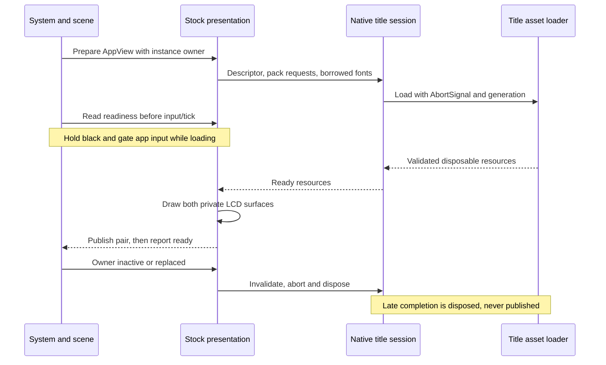

# Runtime composition and ownership

Checkpoint: HOME ownership checked through `05cef1c` (25 September 2026). [Scope](../portfolio-ui-scope.md) limits stock apps to UI
and navigation, with Sound playback and read-only Camera media.

## Startup

[`src/app/page.tsx`](../../src/app/page.tsx) renders one
[`Console`](../../src/components/Console.tsx). Its client effect dynamically
imports `createConsoleScene(host, modelUrl)`. React owns the host, cancellation,
retry and returned teardown. An unmount during initialization disposes the
completed scene when its promise resolves. Import/start failure shows a static
console image and retry control. `/source-preview` is a diagnostic route.

The scene selects quality, creates WebGL/camera/lights and decodes the Meshopt
GLB. It resolves semantic hardware nodes, starts native HOME assets/banner work,
opens IndexedDB and restores validated preferences/saves (with legacy localStorage
fallback), then creates screen canvases and display textures. Native HOME assets
enable the native HOME controller path. It awaits screen/banner readiness and
compiles initial materials before starting the intro clock. VGPU roughness is
deferred to idle and may be omitted on constrained devices.

This initialization is asynchronous but not uniformly deadline-bounded. The
stock-view deadline described below does not cover initial GLB/HOME/storage work.
See [proposed improvements](proposed-improvements.md) for that remaining risk.

## State and resource owners

| Owner | Owns | Lifetime / release |
| --- | --- | --- |
| `Console.tsx` | Attempt, failure state, scene teardown | React effect cleanup or Retry |
| `console-scene.ts` | Renderer, rig, camera, input listeners, clocks, current `MenuState` | Scene teardown |
| `system.ts` / `app-host.ts` | Phases, app instances, caller IDs, effects and input state | Pure transitions; close removes caller trees |
| `screens.ts` | HOME resources/shared fonts, LCD canvases, portfolio graphics | Disposes graphics before HOME assets/fonts |
| `notes-metadata-session.ts` | One hidden Notes description/icon bound to application capture generation | Notes/application replacement, capture change or graphics disposal; sleep retains context |
| `notes-intro-session.ts` | Owner-bound 60 Hz remainder clock and intro/title composer for the live Notes main upper | Notes owner/capture/title replacement, pack loss, sleep or graphics disposal; first ready sample does not backfill download time |
| `stock-screen-presentation.ts` | One foreground native session, image cache, private LCD pair, deadline | Owner replacement, inactivity, retry or teardown |
| `native-title-assets.ts` | Requested packs, textures, renderer and owned fonts | Idempotent result disposal; borrowed fonts survive |
| `runtime-effects.ts` | Capability adapter, portfolio music, ordered save queue | Releases owners; closes storage after emitted writes settle |
| `audio.ts` | Gesture-unlocked context, cues and persistent HOME music transport | Revision/abort guards; scene disposal closes its context |
| `firmware-banner.ts` | Live folder/default/background resources and offscreen targets | Scene disposal; async completion guards |
| `stock-title-banner.ts` | Camera/Sound/Health/eShop common models plus EUR texture replacement | Outgoing/incoming ticket owners (at most two); firmware-banner.ts removes and disposes retired groups |
| `app-persistence.ts` | Version-2 IndexedDB connection | Version change or effect-owner disposal |

Capability/media-storage utilities remain for compatibility and tests. Current
stock modules do not request capture, import, microphone, motion, account or
network operations. Their existence is not a product requirement.

## HOME banner ownership and activation

HOME footer selection also follows the active navigation context. For applet
toolbar focuses 1 through 5, `getHomeFooter` selects the native single Open
button; `touchSystemAction` routes the entire footer to the same focused
applet entrypoint used by A/Start before consulting retained grid actions.
Grid/folder Manual and close actions must not leak into that toolbar context.
This selection fix does not establish native transition or input timing; see
the [footer comparison](../home-applet-footer-2026-10-01.md).

The live chain is `console-scene.ts` → `home-banner-host.ts` →
`home-banner-service.ts` / `home-banner-lifecycle.ts` → immutable host view →
`screens.ts` → injected `firmware-banner.ts` draw callbacks. Selection is
observed at explicit boundaries in the counted HOME pass. Manager work and
attached scene-controller work remain separate; painting does not advance them.
Folder/default readiness is scoped to generation and request epoch. Clear has no primary. Folder/default banners use the native primary path.
Settings, Camera, Sound, Health and eShop now have **provisional** selected-title paths through the host,
service and source model renderer; other stock selections remain
unsupported and release the previous primary. Authored portfolio banners use
their separate painter. The Settings path passes bounded code checks but has
no production-browser LCD capture or matched Azahar diff, so visible pose,
materials, retargeting and timing remain open.

`createStockTitleBannerResourceHost` prepares four common title kinds, all
with live callers owned by `firmware-banner.ts`. The scene retains outgoing
and incoming ticket owners until the HOME host retires them.
See [stock activation](../stock-home-banner-activation.md) for retention,
retarget, disposal, Sound material clock and the provisional native lifecycle boundary. A ticket contains console generation,
request epoch and title kind. Retargeting releases the current model; a late
fetch cannot publish into the new ticket. Its `ready` means prepared GPU
resources, not a displayed LCD frame. Historical Settings executable replays
stop at OS thread-local service `0x139008`; they are source facts, not proof of
what the provisional browser renderer draws. See the
[activation gate](../settings-home-banner-activation-gap.md).
Do not connect stock titles by reusing folder/default activation or by treating a
resolved fetch as show completion. The [implementation process](implementation-process.md)
defines the evidence required for that change.

## Foreground native view lifecycle

Stable view descriptors can share a session across interior navigation (Settings,
Friend List and Notes use this). `owner` is an app instance, not merely a title:
reopening the same title cannot publish the old instance's pending pixels. Pack
requests and font identities determine reuse. A supported view can wait for the
shared font; the 20-second browser deadline includes that wait.

Loading, resource failure and draw failure are explicit. The painter publishes
both LCDs atomically; readiness becomes true only after a successful pair. Timeout
or failure aborts the generation and publishes browser recovery. Retry is explicit;
HOME/B escapes without destroying the suspended caller chain. This is a website
recovery policy, not native firmware error UI. See
[native readiness](../native-screen-readiness.md) for the tested/live subset.

## Shutdown and disposal

Power-off changes virtual console state; it does not unmount Three.js. Suspended
or hidden stock owners release presentation resources and reprepare on return.
Physical lid sleep also releases held inputs and owner capabilities. Sound pauses
and requires an explicit later Play; HOME music has its separate sleep policy.

Full teardown releases inputs, drains/releases effects, removes hidden controls,
disposes audio and screens, then banner/GPU resources and late VGPU products.
It cancels animation/idle work, disconnects observers, removes listeners and
releases scene textures/materials/geometries/environment and renderer DOM.
The successful-start path has this teardown; early initialization failure coverage
is not a proof that every partially allocated resource is released.
