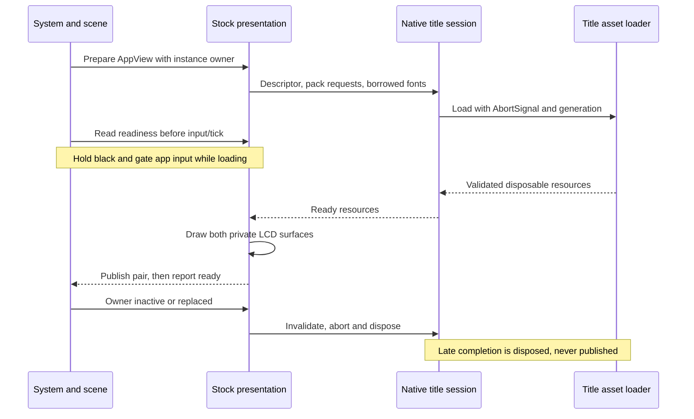

# Runtime composition and ownership

Checkpoint: HOME ownership checked through `05cef1c` (25 September 2026). [Scope](../portfolio-ui-scope.md) limits stock apps to UI
and navigation, with Sound playback and read-only Camera media.

## Startup

[`src/app/page.tsx`](../../src/app/page.tsx) renders one
[`Console`](../../src/components/Console.tsx). Its client effect dynamically
imports `createConsoleScene(host, modelUrl)`. React owns the host, cancellation,
retry and returned teardown. An unmount during initialization disposes the
completed scene when its promise resolves. Import/start failure shows a static
console image and retry control. `/source-preview` is a diagnostic route.

The scene selects quality, creates WebGL/camera/lights and decodes the Meshopt
GLB. It resolves semantic hardware nodes, starts native HOME assets/banner work,
opens IndexedDB and restores validated preferences/saves (with legacy localStorage
fallback), then creates screen canvases and display textures. Native HOME assets
enable the native HOME controller path. It awaits screen/banner readiness and
compiles initial materials before starting the intro clock. VGPU roughness is
deferred to idle and may be omitted on constrained devices.

This initialization is asynchronous but not uniformly deadline-bounded. The
stock-view deadline described below does not cover initial GLB/HOME/storage work.
See [proposed improvements](proposed-improvements.md) for that remaining risk.

## State and resource owners

Unfinished HOME entry holds normal HUD at authored zero-alpha SceneIn20 until
a successful paired native-banner draw is visibly presented. The receipt is
validated against the current generation/request/activation tuple; diagnostic,
failed, stale and context-lost candidates cannot release it. Delayed publication
shifts only the remaining HUD20..40 segment along the existing HOME counter.
Already settled entry and the global clock/wallpaper are not restarted.
Portfolio/clear/unsupported content uses a separately validated bypass keeping
the original HUD epoch; reduced motion keeps immediate HUD40. This host-recovery
adaptation and its evidence are recorded in
[entry recovery](../home-entry-recovery-2026-10-03.md).

Restarted banner release depends on the screen-owned entry footer terminal
receipt. Source frame14 remains requested until a successful live paired paint
is visibly presented by an awake, context-live scene render. Diagnostic repaint
invalidates only its pending candidate; preemption, replacement and disposal
retire ownership. No-footer pickup cannot publish. The existing five-pass gate
still progresses; `nativeWorkerReady` holds release/activation, not a new clock
or delay. This is an adapted caller dependency, not native epoch proof.
See [entry ordering evidence](../home-entry-order-2026-10-03.md).

An observed awake Off-to-boot boundary retires the HOME primary service,
pending/active primary and readiness once per boot identity. Selection,
global clock, wallpaper and monotonic scope survive; the next boundary creates
a fresh scope, rejecting old tickets. Cancel/sleep/ordinary close do not reset.
This capture-supported restart boundary does not establish native relative
footer/banner timing. See [banner restart evidence](../home-entry-banner-2026-10-03.md).

Boot composition withholds HUD/footer until HOME while retaining decoded
base/chrome/grid/fade. This is a capture-supported phase adaptation; the native
entry caller remains untraced. Terminal publication belongs to the scene,
keyed by boot `since` and graphics-context generation. Only a successful native
LCD pair followed by a visible, awake, context-live render can acknowledge it.
At the deadline, a missing receipt holds boot through the current callback;
hide/sleep/context changes revoke it. Diagnostic paints cannot acknowledge it.
Reducer timing stays pure. See [power-on evidence](../home-power-on-staging-2026-10-03.md).
Missing awake native boot composition selects explicit paired authored host
recovery, never a native success receipt. Its visible/accessibility text offers
Retry only; sleeping is inactive and ordinary boot input cannot bypass the
publication barrier.

Post-boot HUD/footer entry belongs to the paired screen owner, keyed by an
observed awake boot identity and relative shared HOME update origin. It never
resets the global clock or advances on repaint. Sleep retains the owner;
nonordinary HOME contexts, resource replacement and disposal retire it.
Diagnostic sample paints are non-mutating, but reuse-only live input paints
must revoke immediately. Source SceneIn frame scheduling remains an
adaptation, not a traced native caller. See [HOME entry evidence](../home-entry-staging-2026-10-03.md).

Close and switch confirmation resolve icon identity from the validated retained
application owner, not HOME selection. The shared presenter selects decoded
single-title `LncDlgIcon_D_00` or two-title `LncDlgIcon_D_01`; its bounded cache
includes dialog kind, owner and pending title. Missing resources fail paired
publication without retiring the suspended owner. Prompt policy and deadlines
remain unchanged; see [Camera close evidence](../home-camera-close-dialog-2026-10-03.md).

Confirmed software switches retain the existing decoded suspended backing
through their close barrier. A null transition *presentation* selects settled
SceneIn20/AppPause20; it does not remove the live transition or skip compositor
capture-owner/generation validation. Ordinary Close still applies AppQuit.
This capture-supported intent choice and its remaining native limitations are
recorded in the [switch backing comparison](../home-switch-backing-2026-10-03.md).

| Owner | Owns | Lifetime / release |
| --- | --- | --- |
| `Console.tsx` | Attempt, failure state, scene teardown | React effect cleanup or Retry |
| `console-scene.ts` | Renderer, rig, camera, input listeners, clocks, current `MenuState` | Scene teardown |
| `system.ts` / `app-host.ts` | Phases, app instances, caller IDs, effects and input state | Pure transitions; close removes caller trees |
| `screens.ts` | HOME resources/shared fonts, LCD canvases, portfolio graphics | Disposes graphics before HOME assets/fonts |
| `notes-metadata-session.ts` | One hidden Notes description/icon bound to application capture generation | Notes/application replacement, capture change or graphics disposal; sleep retains context |
| `notes-intro-session.ts` | Owner-bound 60 Hz remainder clock and intro/title composer for the live Notes main upper | Notes owner/capture/title replacement, pack loss, sleep or graphics disposal; first ready sample does not backfill download time |
| `stock-screen-presentation.ts` | One foreground native session, image cache, private LCD pair, deadline | Owner replacement, inactivity, retry or teardown |
| `native-title-assets.ts` | Requested packs, textures, renderer and owned fonts | Idempotent result disposal; borrowed fonts survive |
| `runtime-effects.ts` | Capability adapter, portfolio music, ordered save queue | Releases owners; closes storage after emitted writes settle |
| `audio.ts` | Gesture-unlocked context, cues and persistent HOME music transport | Revision/abort guards; scene disposal closes its context |
| `firmware-banner.ts` | Live folder/default/background resources and offscreen targets | Scene disposal; async completion guards |
| `stock-title-banner.ts` | Camera/Sound/Health/eShop common models plus EUR texture replacement | Outgoing/incoming ticket owners (at most two); firmware-banner.ts removes and disposes retired groups |
| `app-persistence.ts` | Version-2 IndexedDB connection | Version change or effect-owner disposal |

Capability/media-storage utilities remain for compatibility and tests. Current
stock modules do not request capture, import, microphone, motion, account or
network operations. Their existence is not a product requirement.

## HOME banner ownership and activation

HOME footer selection also follows the active navigation context. Applet
toolbar focuses 1, 2, 3 and 5 select a single Open button. Browser focus4 uses
the source Manual/Open split with the existing x100 contact boundary.
`touchSystemAction` resolves the shared footer hit; Manual invokes the manual
applet with Browser title `0004003000009d02`, while Open and A/Start retain the
focused Browser entrypoint. Grid/folder Manual and close actions cannot leak
into that toolbar context. See the
[Browser footer correction](../home-browser-manual-footer-2026-10-03.md).
Application-owned manual packs and optional neighbor packs live in
`manualSources`; `manualPageZeroAvailable` is the shared capability guard for
input, targets and document painting. Settings and Browser expose page0;
Camera remains index-only. Undelivered pages and operations remain unsupported.
This selection fix does not establish native transition or input timing; see
the [footer comparison](../home-applet-footer-2026-10-01.md).
Footer text uses the generic source-atlas `textSampling: 'lcd'` path, without
capture-fitted coverage or material colours. The
[residual audit](../home-applet-footer-residual-audit-2026-10-01.md) distinguishes
verified static glyph sampling from still-untraced runtime material edges.

HOME applet banner labels use the native `lau_title_*_u` message and its style
through `appletBannerLabel`; folder labels retain the authored pane metrics
and existing width fit. Both render the source `BnrDsTitle_00` surface, but
their two-entry shared cache uses separate keys to prevent style aliasing.
Missing selected applet messages fail explicitly. See the
[source and comparison record](../home-applet-title-style-2026-10-01.md).

The live chain is `console-scene.ts` → `home-banner-host.ts` →
`home-banner-service.ts` / `home-banner-lifecycle.ts` → immutable host view →
`screens.ts` → injected `firmware-banner.ts` draw callbacks. Selection is
observed at explicit boundaries in the counted HOME pass. Manager work and
attached scene-controller work remain separate; painting does not advance them.
All five toolbar selections use ticketed native type14..18 host lifecycles
with per-resource readiness/failure and consume the exact hosted visibility,
scale, yaw and source clip frames. The common generic-primary constructor is
source-identified for all five. Notes, Browser and Miiverse no longer discard
that motion for a front-pose/browser-time rendering adaptation. Reduced motion
retains visibility ownership but renders scale1/yaw0/clip0 as an adaptation.
Native activation/first-frame phase, cadence and displacement remain unproved.
Their former unsupported fallback already painted settled artwork. See the
[ownership correction](../home-toolbar-host-2026-10-03.md) and
[motion source trace](../home-toolbar-motion-source-2026-10-03.md).
Folder/default readiness is scoped to generation and request epoch. Clear has no primary. Folder/default banners use the native primary path.
Settings, Camera, Sound, Health and eShop now have **provisional** selected-title paths through the host,
service and source model renderer; other stock selections remain
unsupported and release the previous primary. Authored portfolio banners use
their separate painter. The Settings path passes bounded code checks but has
no production-browser LCD capture or matched Azahar diff, so visible pose,
materials, retargeting and timing remain open.

`createStockTitleBannerResourceHost` prepares four common title kinds, all
with live callers owned by `firmware-banner.ts`. The scene retains outgoing
and incoming ticket owners until the HOME host retires them.
See [stock activation](../stock-home-banner-activation.md) for retention,
retarget, disposal, Sound material clock and the provisional native lifecycle boundary. A ticket contains console generation,
request epoch and title kind. Retargeting releases the current model; a late
fetch cannot publish into the new ticket. Its `ready` means prepared GPU
resources, not a displayed LCD frame. Historical Settings executable replays
stop at OS thread-local service `0x139008`; they are source facts, not proof of
what the provisional browser renderer draws. See the
[activation gate](../settings-home-banner-activation-gap.md).
Do not connect stock titles by reusing folder/default activation or by treating a
resolved fetch as show completion. The [implementation process](implementation-process.md)
defines the evidence required for that change.

## Foreground native view lifecycle

Stable view descriptors can share a session across interior navigation (Settings,
Friend List and Notes use this). `owner` is an app instance, not merely a title:
reopening the same title cannot publish the old instance's pending pixels. Pack
requests and font identities determine reuse. A supported view can wait for the
shared font; the 20-second browser deadline includes that wait.

Loading, resource failure and draw failure are explicit. The painter publishes
both LCDs atomically; readiness becomes true only after a successful pair. Timeout
or failure aborts the generation and publishes browser recovery. Retry is explicit;
HOME/B escapes without destroying the suspended caller chain. This is a website
recovery policy, not native firmware error UI. See
[native readiness](../native-screen-readiness.md) for the tested/live subset.

## Shutdown and disposal

Power-off changes virtual console state; it does not unmount Three.js. Suspended
or hidden stock owners release presentation resources and reprepare on return.
Physical lid sleep also releases held inputs and owner capabilities. Sound pauses
and requires an explicit later Play; HOME music has its separate sleep policy.

Full teardown releases inputs, drains/releases effects, removes hidden controls,
disposes audio and screens, then banner/GPU resources and late VGPU products.
It cancels animation/idle work, disconnects observers, removes listeners and
releases scene textures/materials/geometries/environment and renderer DOM.
The successful-start path has this teardown; early initialization failure coverage
is not a proof that every partially allocated resource is released.
