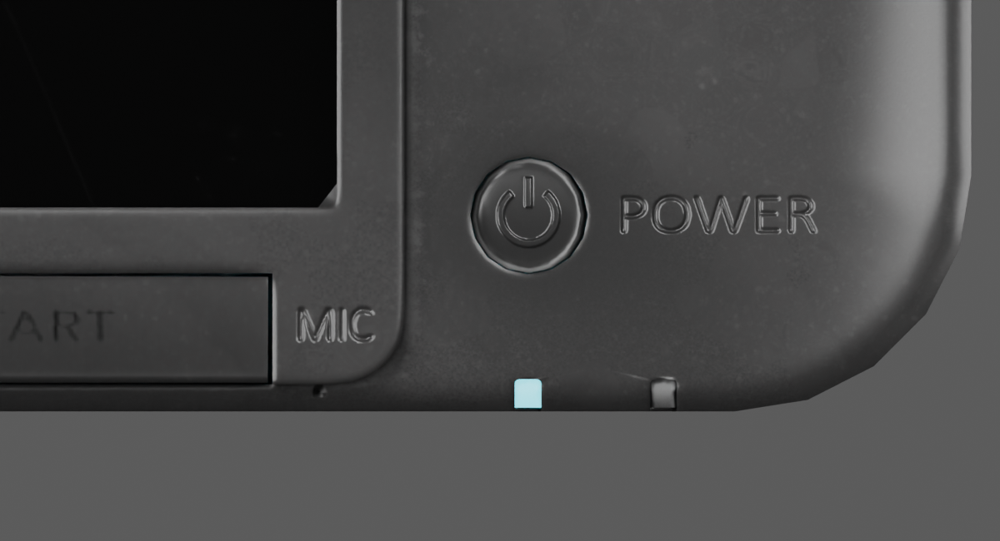
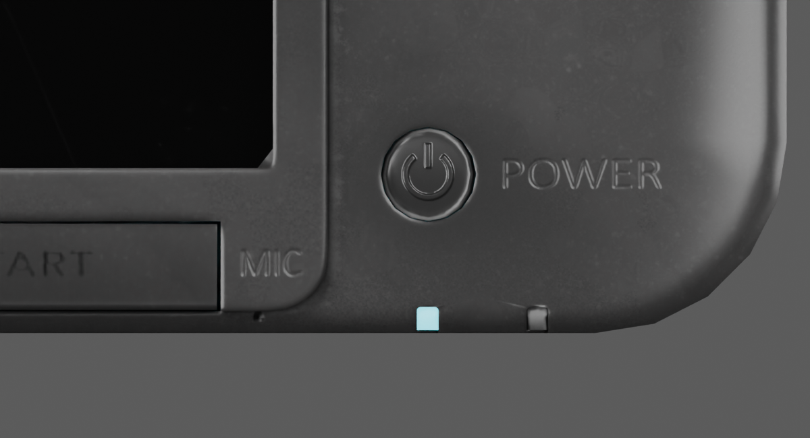

# MIC and POWER relief comparison — 10 September 2026

This is a native Blender experiment, **not a promoted model revision**. The
homepage and saved rig remain the verified `silver-legends` checkpoint.

## Evidence that changes the next edit

[Pocket Gamer's hands-on original-XL report](https://www.pocketgamer.com/features/first-impressions-of-nintendos-3ds-xl/)
describes the microphone location as etched into the plastic. Its
[control photograph](https://media.pocketgamer.com/FCKEditorFiles/3dsxl-first-impressions-3ds-6%281%29.jpg)
was downloaded and inspected; at 450 × 338 it supports the overall treatment,
but does not resolve exact glyph outlines or engraving depth. This contradicts
applying the lower-key dark-print treatment indiscriminately to MIC.

The already inspected [TechRadar front photograph](https://cdn.mos.cms.futurecdn.net/0584727e6f39c0e334d6e9537772f9fa.jpg)
resolves MIC and POWER more clearly. Their edges and contrast differ from the
model's strongly doubled, bright outline. Lighting is different, so that alone
cannot establish an exact normal-map strength or whether every bright edge is
physically wrong. POWER's manufacturing treatment is not independently verified
by the Pocket Gamer statement about MIC.

## Controlled native trial

`scripts/inspect_etched_legends.py` copies the active material temporarily and
attenuates the two words' normal deviation toward adjacent glyph-free columns,
retaining 35% of the original signal. It does not edit geometry, base colour,
roughness, font shapes or the power button symbol. It renders a matched overhead
before/after pair, then restores and removes the temporary material. No file is
saved or exported by this script.

The trial reduces doubled highlight edges, but the thin outlined strokes still
do not establish a photographic match. Simple amplitude reduction is therefore
insufficient evidence for replacing the live asset. The next material pass must
compare actual glyph profiles and recess polarity, rather than treating the
less shiny trial as finished.

## Region isolation

The first MIC rectangle sampled part of the surrounding bevel. The corrected
rectangle is PNG pixels `[623,475,653,518]`; POWER uses `[373,124,428,284]`.
Both use the 4096² normal atlas's top-left origin and a two-pixel feather.
`scripts/audit_etched_regions.py` independently decodes the actual GLB UVs and
source normal pixels. Its `etched-region-audit.json` confirms all 1,290 MIC and
8,800 POWER region pixels belong only to the chassis, and the two baseline
columns have normal blue 255 throughout. The former bevel-contaminated baseline
reached blue 195. The amended trial was rendered and inspected again.

This audit proves isolation of the experiment, not exact engraving depth or
factory glyphs. Existing source attribution and photographic-reference limits
continue to apply. The application was not modified; no application rebuild or
new interaction test was needed for this reversible native experiment.
