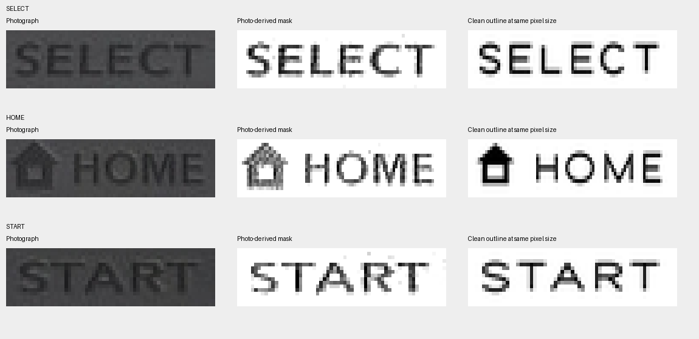
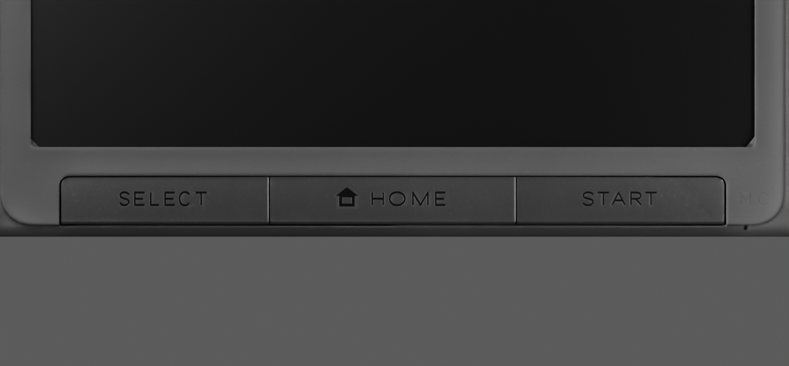

# Clean lower-label outline trial

This follows `lower-label-relief-comparison.md`. The live asset remains `silver-lid-face-web.glb`; the new lettering is a reversible Blender trial pending exportable maps and browser verification.

## Authored artwork and comparison

`build_lower_label_outlines.py` builds SELECT, HOME, START and the house without a font dependency. Each letter uses explicit line/curve paths fitted to boxes in the original 16-pixel-high photographic crops recorded in `legends-atlas-report.json`. The outputs include three editable SVGs and `derived-textures/lower-label-clean-mask.png`, a 1024-square atlas representing a 32 × 24 mm layout with three rows.

The stroke ribbons are constructed in reference-pixel coordinates before the anisotropic photo-to-cap transform; this keeps SVG and raster shape consistent. The atlas is rendered at four-times resolution and reduced with Lanczos filtering. This produces clean continuous outlines but does not recover missing factory detail.

`compare_lower_label_outlines.py` resamples the actual atlas into the exact source crop sizes. The comparison board places the photograph, old thresholded mask and new mask alongside each other; enlargement is nearest-neighbour for pixel inspection. The first draft was too thin. A subsequent uniformly heavier draft overfilled START and misinterpreted the house as an open-bottom doorway. The final study uses reference-space stroke estimates of 1.15 pixels for SELECT/HOME and 1.0 for START, with a filled roof/body and closed-bottom rectangular opening.

Final authored/reference mask coverage ratios are 0.971, 1.021 and 1.019 respectively. Mean absolute alpha differences are 0.090, 0.122 and 0.071. These values diagnose weight and disagreement with the noisy extraction; they are not fidelity scores or proof of factory identity. The letter curves, individual stroke weights, house silhouette and threshold-derived target remain estimates.

## Blender trial

`preview_clean_lower_labels.py` clones only the three lower-key materials and temporarily adds UV1 `LowerLabelPrint`. Only upward-facing polygons receive the atlas projection; other faces sample outside the clipped texture. Existing UV0 stays active. The shader divides out the old mask's colour/specular factors and applies the new mask. Original roughness is retained for the trial, including any old-mask roughness variation. It must be addressed explicitly in the production maps.

The new mask drives inverted bump trials at 0, 0.02 and 0.05 native millimetres on top of the original normal. These are shading depths, not displaced geometry. All renders use the same camera/light settings as the previous lower-label study.

The 0.02 mm final image was inspected with the source-resolution board. It removes broken strokes and the noisy house while retaining dark lettering with restrained edge shading. The initial three depth versions were all inspected; the final post-outline-adjustment decision uses the 0.02 mm image. It is the preferred export candidate, not yet an approved delivery artifact.

## Remaining integration

The diagnostic material contains arithmetic and a Bump node that are not a ready glTF material. Bake or otherwise author equivalent base colour, roughness/specular and normal maps, preserving the mapping between the normal texture and the carried tangent frames. Do not export the trial shader and assume equivalent browser output. Verify non-top cap faces, UV0, geometry, rig, all unrelated material payloads, and removal of the old label's roughness remnants. Inspect native/exported close-ups and physical-button interactions before replacing the public asset.

Both preview helpers restore original material bindings in `finally`; the clean-label helper also removes its temporary UV layers and image datablocks. It does not save the native file or export a GLB. The source SVGs, atlas, comparisons and reproducible scripts are retained as working artifacts. Exact lettering and the larger portfolio goal remain incomplete.
