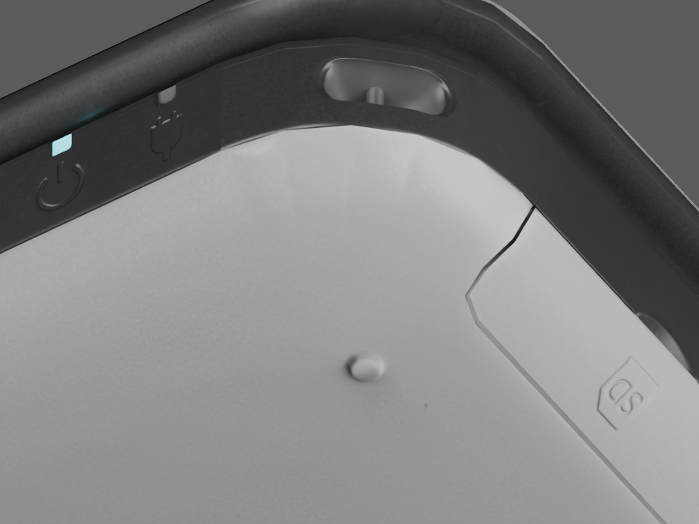

# Black chassis corner refinement

Preserved model: `model/candidates/joshua-xl/silver-chassis.blend`, SHA-256 `42bbec5344bd0ea86b5ad6670c307af5ac6c4ef9411f1a7c1fdeabb8e38e8e07`. It is followed by the [circle-pad refinement](source-pad-validation.md). The previous `silver-cover` checkpoint is also preserved.

The rounded front corners of the black chassis still used a segmented contour after the silver cover was refined. `scripts/smooth_sourced_chassis_corners.py` fits a 12.538453 mm arc to six existing front-outline points between native Z = 6 and 14 mm. The relative circle centre is `(64.645161, −33.940477)` with an X origin of −0.210388 mm. This is a fit to the sourced model, guided by the continuous rounded silhouette in the original-XL photographs documented in `source-side-audit.md`; it is not a measured factory radius.

The pass refines and deforms only the front corner region of `Sourced graphite chassis`, with transported UVs and normal/tangent frames. Movement fades in between Z = 5.65 and 6.4 mm. The silver cover and its lower texture seam remain fixed. An initial selection found mixed source tangent handedness around X = 60–61.2 mm, beside a front-edge detail outside the fitted arc. Refinement now starts beyond absolute relative X = 62 mm, excluding that unchanged detail. No incompatible frames are averaged.

The chassis increases from 56,682 to 63,492 triangles. 3,417 vertices move by at most 0.154380 mm; the minimum deformation Jacobian determinant is 0.995029. See `model/candidates/joshua-xl/chassis-smoothing-report.json`. All other meshes, transforms, hierarchy, materials and embedded texture images are retained exactly.

## Matched views

The macro camera and lighting match the preceding cover pass:

The black corner contour is smoother. The small SD-cover seam and source details remain visibly segmented in this extreme close-up and are not declared fixed.

All six complete after views were rendered and inspected: `chassis-after-{front,open,top,side,rear,underside}.png`. They use the same cameras as `cover-after-*`, preserving the closed seam, silver wraparound finish, control layout and underside artwork.

## Verification and limits

All 59 tests pass. The two new export tests verify preserved other meshes/materials/images, unchanged lower-cover vertices, closed 156 × 93 × 22 mm dimensions, and valid normal/tangent frames. The framing test also exercises the newly shipped GLB across portrait/landscape sizes and hinge/drag/zoom poses.

In the browser at 1280 × 720, the model loads at 155° with VGPU ready. Lower-screen tapping selects a folder, and a second tap opens it. HOME and lid controls remain operational. This geometry-only pass leaves the application and shaders unchanged.

The photographic comparison does not establish exact local curvature, factory glyph shapes or measured material reflectance. The source detail seams, lettering and authentic HOME Menu assets remain unfinished requirements.
