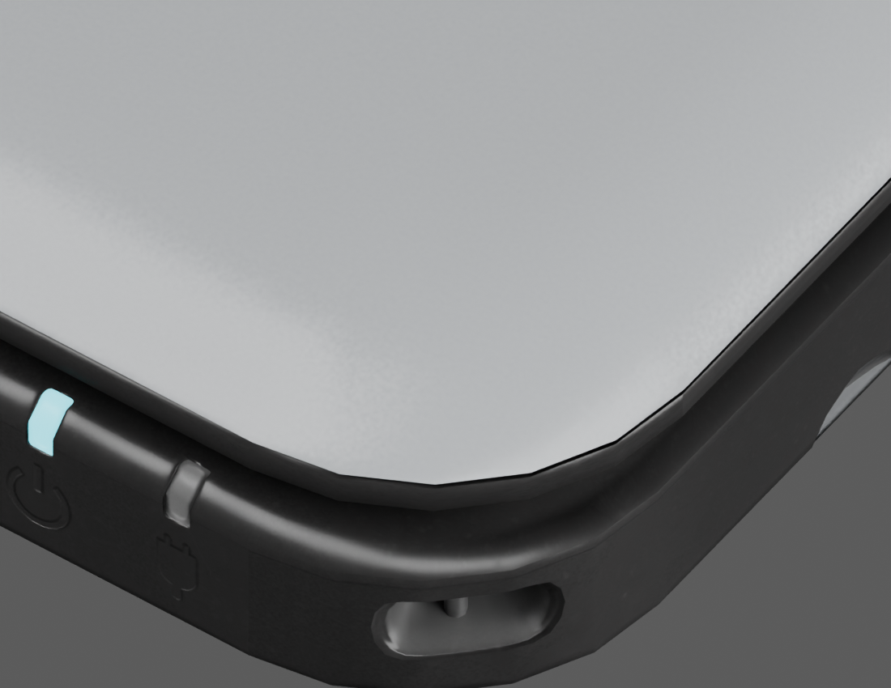
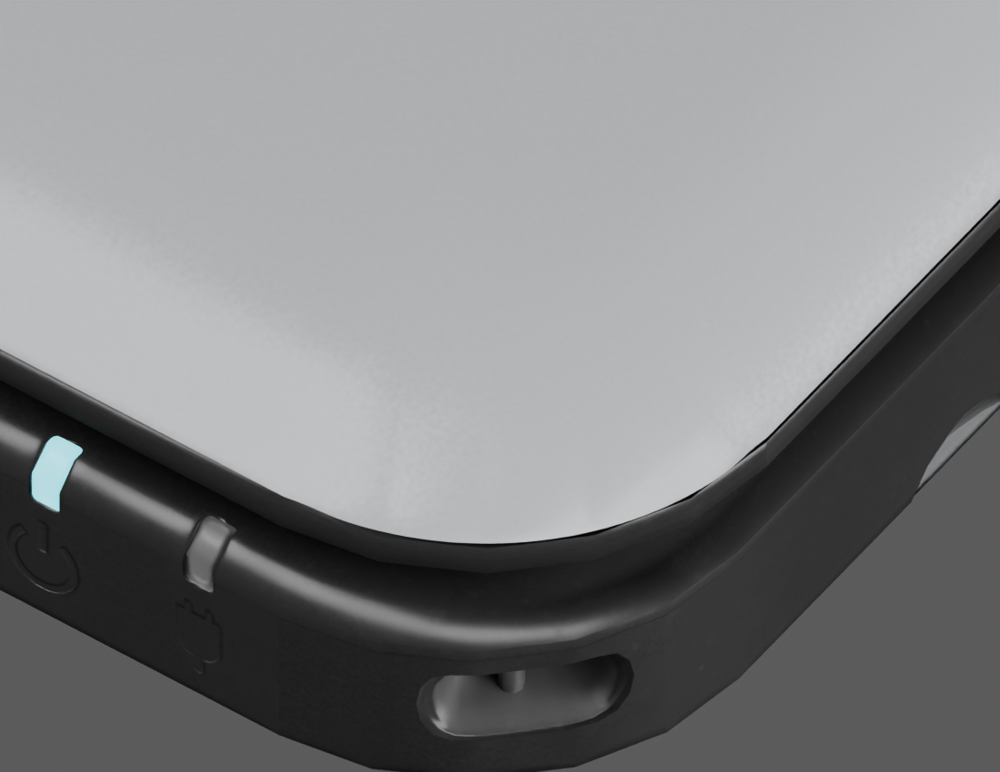

# Sourced lid front-corner refinement

The active checkpoint is `model/candidates/joshua-xl/silver-corners.blend`; its adjacent GLB is mirrored to `public/models/candidates/joshua-xl.glb`. SHA-256: `888afda46926ef705dd2c830c857cd4fca374b5af9d49ff3fc0a2fe406a8941d`.

The preceding `silver-etched` lid still showed straight segments around its rounded front corners. This pass refines only the outer lid and fits a smooth arc to its existing contour. The maximum vertex movement is 0.164716 mm. The lower mating edge is held fixed, and the closed envelope remains 156 × 93 × 22 mm.

## Evidence and method

The [Wesk physical scan](https://bitbuilt.net/forums/threads/3ds-xl-ll-scan.7046/) supports a rounded front outline. `scripts/compare_lid_outline.py` compares it with the preserved pre-change lid; [comparison plot](lid-outline-comparison.png) and [measurements](lid-outline-comparison.json) record the alignment. The scan is levelled and translated, without scaling; its depth orientation is matched using the rounded front versus clipped hinge-side corners. It represents one scanned unit, not manufacturer CAD.

`scripts/smooth_sourced_lid_corners.py` operates on `silver-etched.blend`. It refines local edges, applies a vertically and radially tapered contour correction, and transports UVs, normals and tangents. The fitted radius is 13.051727 mm. Scan triangles are not included in the exported asset. Do not run the script repeatedly on its output.

The outer lid increases from 28,554 to 44,054 triangles; 1,850 vertices move. The minimum deformation Jacobian determinant is 0.981379. See [report](../model/candidates/joshua-xl/corner-smoothing-report.json).

## Visual validation

Matched close views show the polygonal outline before and smooth contour after:

Six matched views are saved as `corners-before-*` and `corners-after-*` in the candidate directory: front, open, top, side, rear and underside. All six resulting views were inspected. Their [pixel comparison](../model/candidates/joshua-xl/corner-render-comparison.json) records the limited affected area; small render differences are not proof of geometric change. The control deck, cameras, hinge and underside artwork remain in place.

## Export and interaction checks

- `npm test`: all 54 tests pass, including two new corner tests.
- Export checks retain all other meshes' attributes and indices, material/image payloads, hierarchy and transforms. They verify closed dimensions, unchanged lower mating vertices, and valid transported normal/tangent frames.
- Blender reopened the saved checkpoint successfully: 76 objects, packed texture images and the Hinge rotation-limit constraint are present.
- Browser at 1280 × 720: closed-console drag rotation and opening to 155° work; VGPU reports ready.
- Browser at 390 × 844: default open and closed views fit; physical A opens a folder and HOME returns to the menu. No captured warnings or errors. The temporary viewport override was reset.

## Remaining limitations

This is a local contour correction, not proof of exact factory shape. The existing dark closed side seam, lower-cover corner faceting, faint MIC lettering and unverified glyph shapes still need comparison. The HOME Menu remains an approximation pending usable firmware assets. Browser inspection also found that rotating the open console sideways can clip it on a narrow viewport, although the default mobile presentation fits. That framing issue remains unresolved by this mesh-only pass.
