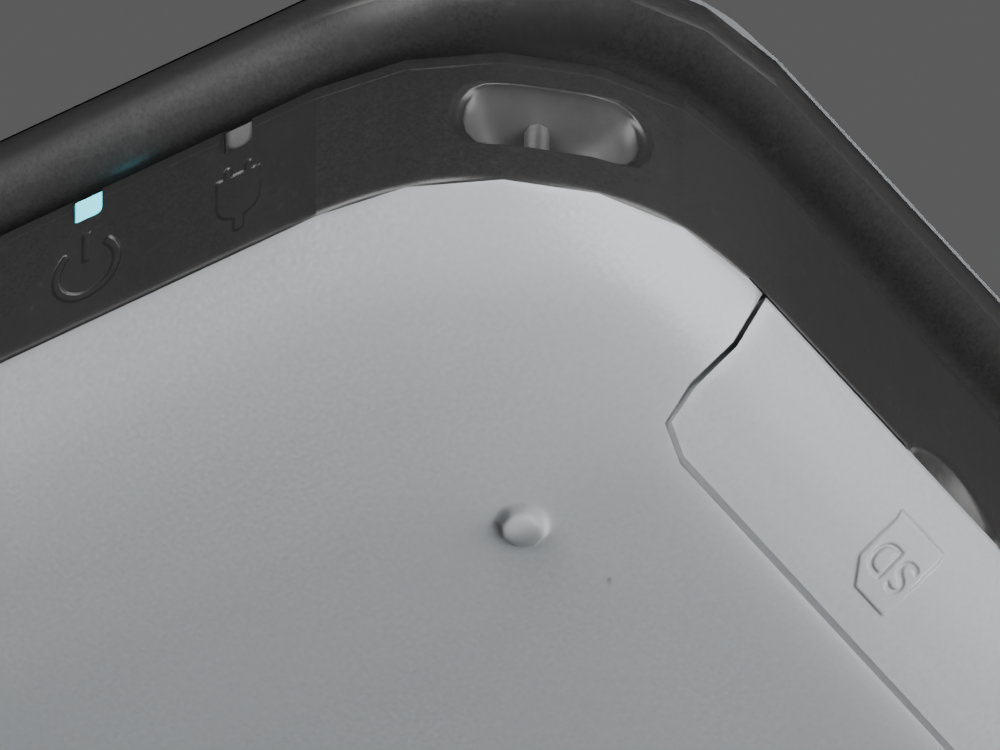

# Lower-cover corner refinement

Preserved files: `model/candidates/joshua-xl/silver-cover.blend` and adjacent `.glb`, SHA-256 `7b479bc94e81966120dc2150896db137bbef7f7255cd30a420123edcfb1c79a4`. This checkpoint is followed by the [black chassis refinement](source-chassis-validation.md). The preceding `silver-corners` files are also preserved.

The silver lower-cover corner had visible straight contour segments. The underside photograph recorded in `source-eur-validation.md` supports a continuous rounded transition. This pass fits an arc to the existing model outline, retaining its broad curvature and texture artwork. It is an authored refinement, not a factory radius measurement.

## Geometry and source seam

`scripts/smooth_sourced_cover_corners.py` starts only from `silver-corners.blend`. It operates on the lower region of `Sourced graphite chassis`, which contains both the cover and other fixed body surfaces. The fitted radius is 12.109781 mm; the relative circle centre is `(64.285806, -33.544660)` mm with an X origin of −0.210388 mm. The fit uses five existing lower-outline points on the right front corner, mirrored for the left corner.

Shared-edge refinement and a tapered radial correction remove facets in the silver corner contour. Movement fades between native Z = 4.7 and 5.5 mm; every vertex at or above 5.5 mm is retained. The initial broader selection encountered six edges with conflicting source tangent handedness near Z = 5.599–5.631 mm and stopped before saving. Restricting the correction to the lower cover preserves that existing upper seam rather than interpolating incompatible frames. This also leaves the deck and contact geometry unchanged.

The chassis increases from 45,379 to 56,682 triangles. 1,369 vertices move, by at most 0.149525 mm. The minimum sampled deformation Jacobian determinant is 0.998555. Full values are in `model/candidates/joshua-xl/cover-smoothing-report.json`. Other meshes, hierarchy, transforms, materials and embedded images remain exact. UVs and shading frames are carried through subdivision and deformation.

## Matched visual evidence

The macro uses the same orthographic camera at `(115, −110, −85)`, target `(67, −37, 3)`, scale 40 mm, 1000 × 750. The silver contour is smoother; the adjacent black upper boundary and the SD cover seam still retain source faceting.

Six complete after views are saved as `cover-after-{front,open,top,side,rear,underside}.png`, matched to the preceding `corners-after-*` views with `render_sourced_dimensions.py`. All six after views were inspected. Cameras, ports, controls, seams and underside artwork remain in place. Source boot artwork in native renders is replaced by live display panels in the website.

## Verification

- All 57 tests pass. Two new export checks cover exact preservation of other meshes/materials/images, 156 × 93 × 22 mm closed dimensions, retained upper chassis vertices, and finite orthogonal normal/tangent frames with valid handedness.
- Browser at 1280 × 720: the model loads with VGPU ready, physical A opens a folder, H returns HOME, Space closes the lid, and dragging exposes the textured underside. No captured warnings or errors. Temporary viewport override reset afterwards.
- This is a mesh-only change; application code and the previously passing production build are unchanged.

This improves the silver cover, but does not resolve the adjacent black chassis facets, exact hardware glyph shapes, broader material fidelity or the pending authentic HOME Menu assets. Keep those requirements open.
