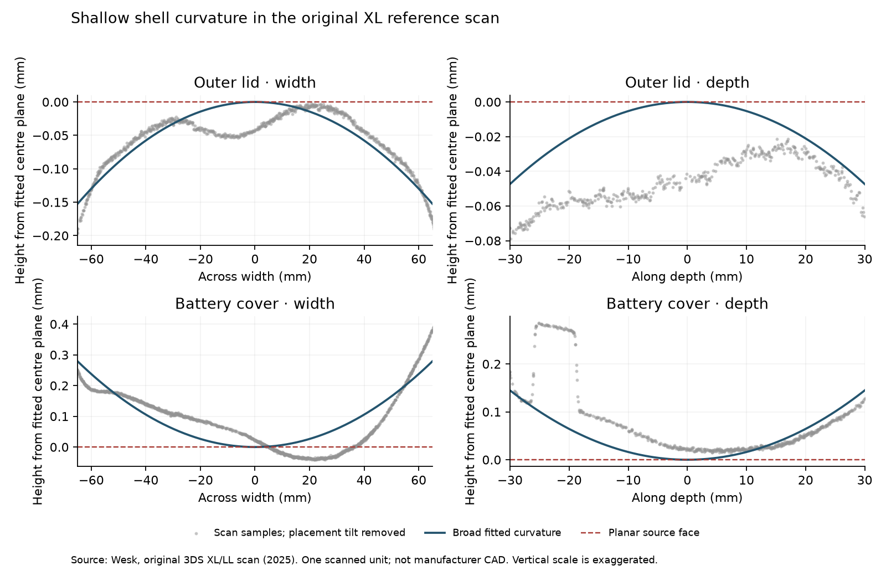

# Sourced shell curvature — 10 September 2026

The active downloaded-model derivative now has shallow broad curvature on its
outer lid and underside. It preserves the existing rolled edges, paint artwork,
controls and hinge. The editable file is
`model/candidates/joshua-xl/silver-curved.blend`; its closed GLB is mirrored at
`public/models/candidates/joshua-xl.glb`. The earlier `silver-source` checkpoint
and original source download remain intact.

## Evidence and interpretation

[Nintendo's original LL specifications](https://www.nintendo.co.jp/hardware/3dsseries/3dsll/index.html)
identify a complete closed console of 156 × 93 × 22 mm, with active displays of
106.2 × 63.72 mm and 84.96 × 63.72 mm. They do not specify a shell crown or paint
roughness. The user's photographs and the additional silver-unit photographs
remain the finish and silhouette references.

[Wesk's original 3DS XL/LL scan](https://bitbuilt.net/forums/threads/3ds-xl-ll-scan.7046/),
published 5 September 2025, provides physical shell scans for reference. This is
the original XL, not the New XL. The author notes that occluded regions can have
scan artifacts. The archive is retained only in ignored local storage, with
SHA-256 `dd3d1dd0e7c6ddee87774fefe20ca9677b97e7e1f1cbb43eee2b45cc4d1fd7cd`.
No scan triangles or textures are included in the shipping derivative.

The top shell and battery cover each contain approximately 2.5 million triangles.
Their widths are 155.184 and 155.181 units. STL has no unit metadata; treating
these as millimetres is an inference from their relationship to Nintendo's
156 mm complete console. This is one scanned unit, not calibrated manufacturer
CAD. The battery cover is only part of the console's underside.

`scripts/measure_reference_scan.py` samples every tenth triangle centroid on the
broad outward-facing regions. It fits a quadratic surface in three windows,
separating placement tilt from curvature. The lid's approximately 2.3-degree
placement tilt must not be interpreted as a hardware slope. The widest-window
fit has RMS residuals of 0.024 mm for the lid and 0.076 mm for the cover. Local
waviness, asymmetry, scan error and the sticker depression remain visible in the
samples; the symmetric quadratic correction deliberately does not copy those
features. Complete coefficients and window sensitivity are in
[reference-scan-measurements.json](reference-scan-measurements.json).

The broad fit implies about 0.15 mm centre-to-edge curvature on the lid and
0.28 mm on the cover across a 130 mm span. These values support a small departure
from the source's planar broad faces. They are not manufacturing tolerances or
proof of the precise curvature of the user's unit.

## Applied geometry change

`scripts/curve_sourced_shell.py` starts from the verified silver baseline GLB.
It adds shared-edge midpoint refinement on the outer lid and underside, with
interpolated UVs and shading frames. It does not apply subdivision smoothing
that would shrink the existing perimeter or move control caps. The complete
asset increases from 9,353 to 59,986 triangles.

The displacement uses the fitted symmetric width/depth terms, fades smoothly
to zero near the existing rolled edges, and is gated to the exterior layers.
Maximum changes are 0.202 mm on the lid mesh and 0.426 mm on the chassis mesh.
Nearby underside pieces follow the same field; exterior camera components move
rigidly by approximately 0.024 mm and the microphone by 0.038 mm. The 12 physical
controls, display anchors, hierarchy and rest transforms remain unchanged.

Original full-precision frames are interpolated and transformed with the local
deformation Jacobian. Export carries those frames explicitly; it does not use
the old helper that requires an unchanged topology. All seven silver-baseline
embedded PNG payloads and material definitions remain identical.

An independent read of the final exported vertex positions gives a closed
envelope of **156 × 92.396667 × 22.205564 mm**, versus the previous
156 × 92.396667 × 22.232855 mm. Width and depth have not changed. The remaining
0.603 mm depth and 0.206 mm thickness discrepancies are still unresolved.

## Inspection and verification

Matched native views are `curved-open.png`, `curved-closed.png` and
`curved-underside.png` beside the editable model. They use the same camera and
lighting setup as the preceding `silver-*.png` images. The change is subtle;
geometry probes establish it more clearly than a broad-lighting screenshot.
The underside render has the hinge at the bottom, so rotate the comparison
orientation when using the user's photograph 5.

At 1280 × 720, the actual browser export was inspected open, closed and from the
underside. No new camera gaps or detached shell edges were observed. The intro
settles at 155 degrees; Space closes to 0 degrees and reopens. A/B, lower-screen
selection and second-tap opening, and physical HOME all operated the menu. VGPU
reported ready, and the preview reported no shader warnings or errors.

The new geometry tests cast independent surface probes onto actual triangles.
They verify a broad crown, unchanged UV interpolation at fixed physical points,
retained image payloads and material factors, unchanged control attributes,
valid shading frames, and the unchanged closed footprint. They do not establish
photographic fidelity. After promotion, all 38 tests, TypeScript checks and the
production build passed. The VGPU shader is unchanged from its preceding
validated checkpoint; the browser compiled it successfully on the new asset.

## Remaining differences

Fine silver paint grain is still too weak in the browser's broad-face views.
The source USA underside text must still be adapted to the user's EUR unit.
Screen centring within the source glass remains provisional. This measured
curvature pass does not resolve those issues or the remaining whole-console
dimensions. HOME Menu graphics and typography are still authored placeholders;
the separate firmware task's decrypted-asset dependency remains open.
