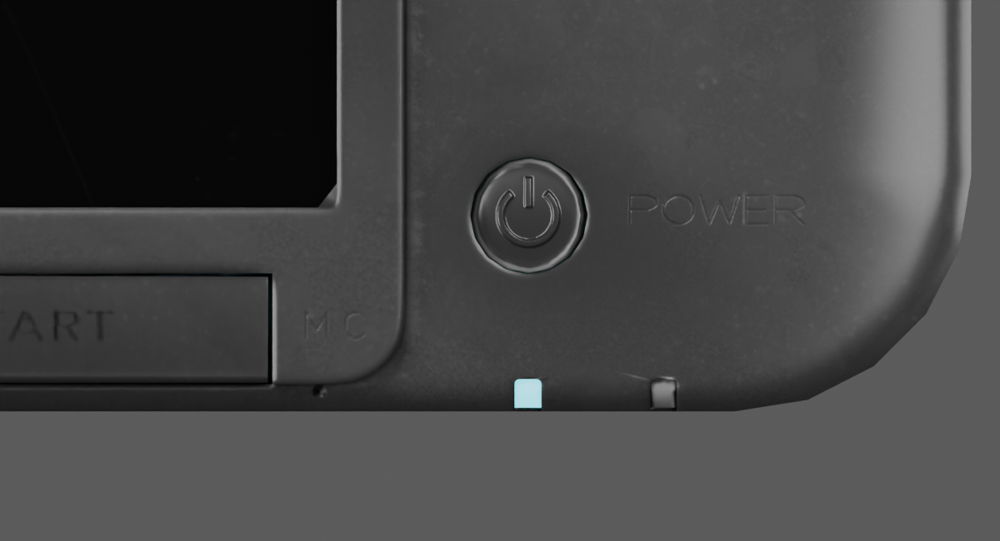

# Smooth MIC/POWER engraving — 10 September 2026

The latest homepage retains these materials with [smoothed front lid corners](source-corners-validation.md).

This preserved material checkpoint is `model/candidates/joshua-xl/silver-etched.blend`.
Its `silver-etched.glb` is mirrored to `public/models/candidates/joshua-xl.glb`.
Both GLBs have SHA-256 `a76c14e35433bbb7f4acf3841c9a34e73efbecba7de4e369ef8ee5521ebdd50c`.
The earlier `silver-legends` checkpoint and rejected experiments remain preserved.

## Visual change and reference limits

The bright doubled outlines around the old MIC and POWER words have been replaced
with smooth fitted strokes and a subtler recessed appearance. The strokes are
manually authored monoline paths guided by the [TechRadar original-XL front
photograph](https://cdn.mos.cms.futurecdn.net/0584727e6f39c0e334d6e9537772f9fa.jpg).
[Pocket Gamer's hands-on report](https://www.pocketgamer.com/features/first-impressions-of-nintendos-3ds-xl/)
supports treating MIC as etched plastic; it does not specify depth or a typeface.
These paths are **not a verified factory font or an exact tracing**.

The fitted stencils avoid the jagged highlights introduced by the rejected raw
photograph-gradient experiment. The estimated normal-map recess is 0.025 mm,
with a 0.6 base-colour multiplier within the stroke as approximate cavity shading.
This is a texture representation, not a change to the mesh surface. POWER uses
1.5 mm glyph height and 0.105 mm strokes; MIC uses 1.35 mm height and 0.095 mm
strokes. Positions, spacing, depth and finish are image-guided estimates.

The 4096² shared atlas softens the finest strokes compared with the live stencil
shader, particularly MIC. The marks are faint at ordinary page scale and on mobile.
This pass improves the harsh source relief but **does not close the exact-lettering
requirement**. Further work should assess local texture resolution and contrast
against matched real-unit lighting. The power-button symbol, ABXY and other source
markings remain unchanged and need their own comparisons.

## Reproduction and independent checks

From the preserved `silver-legends.blend`, run `build_etched_stencils.main()` through
Blender MCP. The fitted paths are rendered as constant-width planar stroke meshes
with round joins in isolated scenes; no installed font is used. Then run
`inspect_etched_legends.main(smooth=True, bake=True)`. The isolated emission atlas
renderer saves `body-etched-basecolor.png` and `body-etched-normal.png`, restores
the production material and makes no production export.

Run `scripts/audit_etched_atlas.py` independently before
`install_etched_legends.main()`. It revalidates the actual GLB's UV coverage and
baseline columns and compares all pixels against the previous maps. Results:

- 559 colour pixels and 8,382 normal pixels changed; zero outside the two bounded regions.
- The two regions map exclusively to the chassis, with no shared pixels on other parts.
- All other image maps, material settings, geometry attributes, UVs, shading frames,
  transforms, hierarchy and prior metadata are retained by the export tests.
- The installed native file packs both derived maps and retains the existing
  lower-key specular map and paint mask.

The shared UV renderer temporarily replaces only the trial material's surface
output and uses a separate scene. It restores the output and removes its temporary
objects afterward. `install_etched_legends.py` validates map hashes before saving
the new checkpoint and exports through the carried-frame path.

## Browser verification

All 52 `npm test` checks passed, including the new complete geometry/material
preservation checks and the public mirror identity test. No application code
changed, so no new application build was needed.

The homepage was inspected at 1280 × 720 and 390 × 844. It remains fully framed,
with only the console and background visible. The DOM reported the sourced asset,
metadata layout, 155° open hinge and `vgpu=ready`; browser warning/error logs were
empty. Clicking the physical power cap turned the displays and indicator off
and back on at desktop and mobile sizes. The viewport was restored afterward.
The VGPU-unavailable fallback was not newly forced; the complete baked maps are
present in the exported asset, but that is not a new visual fallback test.

The wider goal remains active: remaining glyphs, subtle corner/seam fidelity and
the authentic HOME Menu/decrypted firmware assets are still unresolved.
