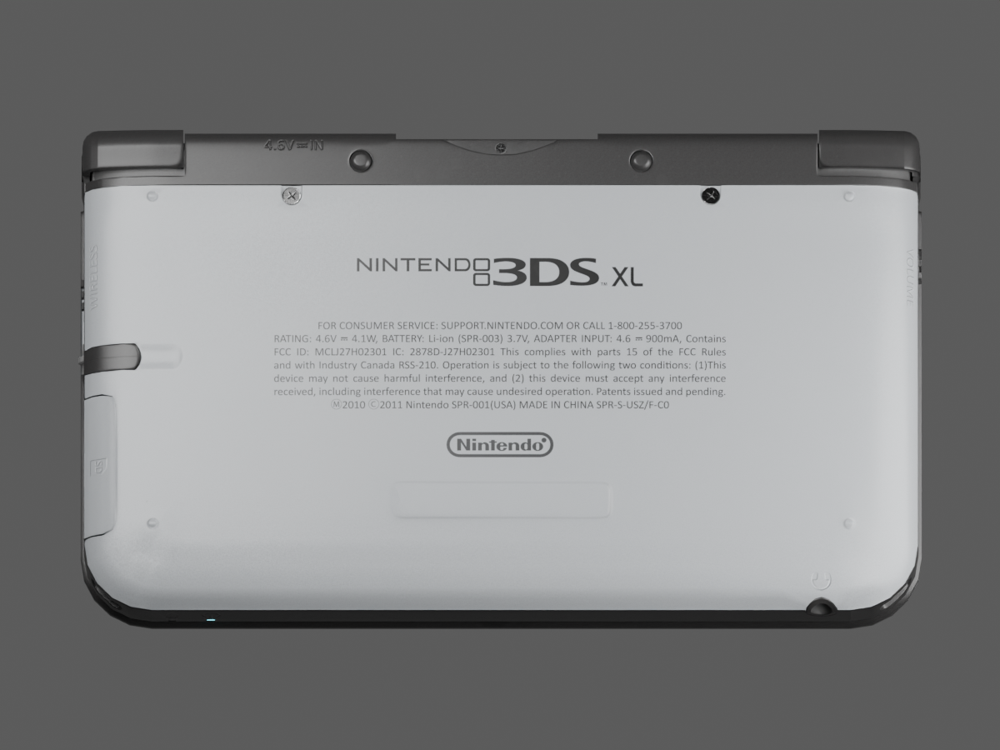
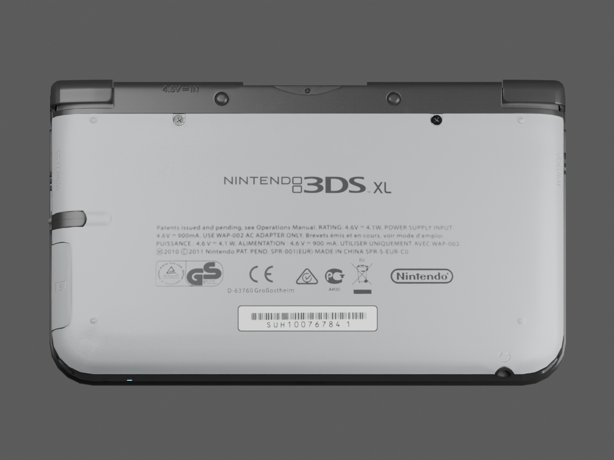

# EUR underside artwork — 10 September 2026

Current update: [the published-envelope correction](source-dimensions-validation.md) is now active. This record describes its preserved preceding checkpoint.

The active editable model is `model/candidates/joshua-xl/silver-eur.blend`.
Its verified closed export is mirrored at `public/models/candidates/joshua-xl.glb`.
This pass replaces the sourced USA underside artwork with the user's EUR layout,
retaining the curved geometry, rig and fine paint grain from `silver-grain`.
Earlier checkpoints remain preserved.

## Evidence and appearance

The user's image5 supplies the certification symbols, address and serial-label
ink. The stylus obstructs part of the regulatory text and first seal. The
[unobstructed original EUR underside photograph](https://konsolen-chips.de/media/image/product/7758/lg/nintendo-3ds-xl-konsole-silber-schwarz-gebraucht~4.jpg),
from the [matching console listing](https://konsolen-chips.de/Nintendo-3DS-XL-Konsole-silber-schwarz-gebraucht),
supplies the four-line text block and GS group. The listing's image data offers
800 × 800 pixels as its largest version. The source model supplies the main
Nintendo 3DS XL wordmark. Reference paths, hashes, crops, thresholds and physical
placement are recorded in `eur-ink-plate-report.json` beside the model.

This is photographic ink reconstruction: source glyph silhouettes are sampled
into a monochrome plate, separating dark ink from the photographed silver and
lighting. No generic font or substitute Unicode symbol was used to redraw the
artwork. The tiny text and GS seal retain the source photograph's limited
resolution; this is not verified factory vector artwork or a named Nintendo font.
The serial reads SUH100767841 in the reference. Its barcode is image-derived;
the encoding has not been decoded or verified. The tiny certification caption
remains image-derived without a claimed transcription.

The matched native views use the same camera and studio lights:

| Before: USA source print | After: EUR photographic artwork |
| --- | --- |
|  |  |

The wordmark moves down to the reference's approximate position, followed by
four left-aligned regulatory lines, a certification row, the address and a serial
label. The previous blank sticker relief is cleared. The new label has a rounded
border and separate paper roughness, but no raised physical sticker geometry.
The physical placement is estimated from perspective photographs, not factory
measurements. The broad studio light is not calibrated to the reference exposure.

## Reproduction and export

1. Open the preserved `silver-grain.blend` through Blender MCP.
2. Run `scripts/create_eur_ink_plate.py` to produce a 2048 × 1152 ink plate in an
   isolated emission scene. Raw reference photos stay in ignored local storage.
3. Run `scripts/apply_eur_underside.py`. It copies the actual underside triangles
   into an isolated UV-space scene and carries native millimetre coordinates in
   a second UV layer. This maps the print onto the source atlas without a global
   affine approximation or a change to production geometry.
4. The script renders 4096² base-colour, paint-mask, normal, metallic/roughness
   and edit-mask PNGs. Nonempty pixel guards run before installing the material.
   Cleared ink regions regain silver paint and fine grain. Ink and paper are
   excluded from the runtime paint effect. The material stores the new mask URL
   `/models/candidates/joshua-xl-eur-paint-mask.png`.
5. Save and export using the curved model's carried shading frames:
   `export_static(..., restore_frames=False, export_attributes=True)`, then
   `curve_sourced_shell.restore_export_frames`. Never use the original geometry
   correspondence restorer on the refined mesh.
6. Run `scripts/audit_eur_atlas.py` with NumPy/Pillow for independent decoded-pixel
   inspection, then the model tests. `scripts/render_eur_underside.py` reproduces
   the native comparison camera and restores production scene state afterward.

An initial transfer had a temporary camera far-clip error and produced empty
atlases. Native inspection caught it before promotion. The corrected camera and
nonempty guards are now part of the script; the public asset uses the audited
final output.

## Verification

The edit mask covers 493,048 of 16,777,216 atlas pixels. Every decoded pixel
outside that mask is identical to the preceding paint-grain checkpoint.

| Map | Changed pixels | Changed outside edit mask |
| --- | ---: | ---: |
| Base colour | 234,044 | 0 |
| Paint mask | 195,820 | 0 |
| Normal | 216,452 | 0 |
| Metallic/roughness | 440,091 | 0 |

The old USA upper-text and wordmark probe strips are uniformly restored silver.
The previous sticker's strong normal lip is removed. The metallic/roughness
map's red and blue channels are unchanged everywhere. Full hashes and probes
are recorded in `eur-pixel-audit.json`.

`tests/source-eur.test.mjs` compares every mesh position, index, UV, normal and
tangent byte against `silver-grain.glb`, plus every node's parent and transform.
It checks display/curvature metadata, embedded image hashes and the public mask.
The geometry and rig are unchanged, and the four unrelated embedded images are
retained. The homepage test binds the shipped asset to the verified EUR export.

Browser inspection at 1280 × 720 showed the new artwork on the rotated underside,
VGPU ready, the hinge at 0° closed and 155° open, and physical A/HOME operating
the menu. A previous texture-load log entry predates the fresh inspection;
the settled view loaded its maps. No shader code changed in this pass.

All 42 project tests, TypeScript checking and the Next.js production build passed.

## Remaining differences

The closed geometry still measures 156 × 92.397 × 22.206 mm rather than Nintendo's
156 × 93 × 22 mm. The live LCDs have published active dimensions but provisional
placement within the source glass. Front hardware legends remain source artwork
whose exact glyphs and placement need comparison. Silver colour, grain scale,
micro-scratches and local shell shape remain photographic approximations. The
HOME Menu still uses placeholder artwork and typography, with decrypted firmware
assets pending in its separate task. This checkpoint does not establish exact
visual identity or complete the full project goal.
