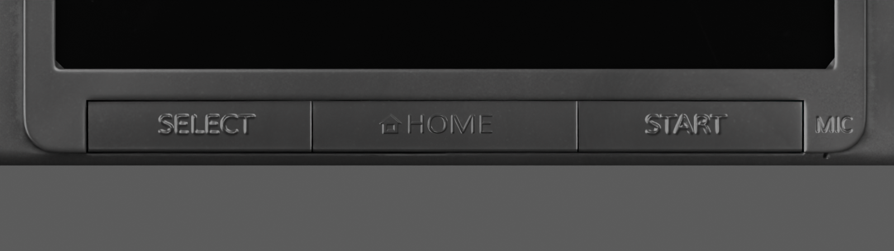
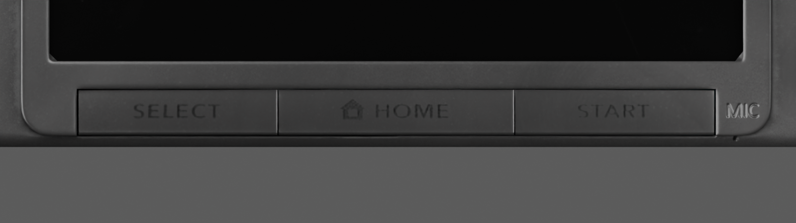

# Photographic lower-key lettering — 10 September 2026

Later evidence qualifies this pass’s flat-ink interpretation: see [the lower-label relief comparison](lower-label-relief-comparison.md). The photograph-derived shape remains useful, but the physical finish and clean outlines are not resolved.

The latest homepage adds [smooth fitted MIC/POWER engraving](source-etched-validation.md) while retaining this lower-key pass.

The preserved lower-key checkpoint uses `model/candidates/joshua-xl/silver-legends.glb`, mirrored at
`public/models/candidates/joshua-xl.glb`. The editable file is `silver-legends.blend`.
SHA-256 of both GLBs: `580093f70a82dc7fdf7af2a11cc26171fb7ae66cbe5d1852079f780446b8de66`.

## Reference and visible correction

[TechRadar's original-XL front photograph](https://cdn.mos.cms.futurecdn.net/0584727e6f39c0e334d6e9537772f9fa.jpg)
shows dark SELECT/HOME/START print and a house symbol. Its native 1794 × 1009
image was inspected alongside the source render. The original JPEG gives cleaner
strokes than the site's recompressed `-1794-80.jpg` version. The exact source hash,
pixel crops and projection fits are in `legends-atlas-report.json`.

The source model encoded the old glyphs in its normal map, giving them raised,
bright edges under studio lighting. This pass transfers only the photographed
ink, interpolates the surrounding glyph-free normal field under the old relief,
and authors lower reflectance for the ink. It does not substitute a generic font.

Matched overhead close-ups, rendered in Blender with the same camera and light:

The new words have broader spacing and dark strokes without the former shiny
outline. The house and some thin strokes remain soft and uneven at macro scale:
the photographed glyph height is only about 8–12 pixels. This is an improvement
in shape and finish, not proof of exact factory lettering. Placement, threshold,
base-colour multiplier 0.18, roughness 0.52 and full-ink specular factor 0.05 are
visual estimates, not manufacturer measurements.

## Export and isolation evidence

`scripts/texture_sourced_legends.py` renders the mapped source photograph through
Blender shader nodes onto the existing cap-top UV triangles. The independent
`scripts/audit_legends_atlas.py` decodes the old and new maps and checks all other
body triangles for shared edited texels. Its report proves:

- Zero changed pixels outside the bounded edit mask; no other source face overlaps it.
- Exactly 3,719 base-colour, 18,846 normal and 3,793 metallic/roughness pixels change.
- The 3,828 changed specular pixels lie inside the same region; all others retain factor 1.
- No geometry, UV, shading frame, transform, hierarchy or display metadata changes.

Blender's exporter initially left the specular image alpha white when its colour
output fed a scalar socket directly. An explicit Separate Color red output now
feeds the IOR-level multiplier. `scripts/audit_legends_export.py` verifies that
the actual embedded glTF specular alpha equals the authored grayscale map with
zero byte error. The new extension is `KHR_materials_specular`; unrelated
materials and image payloads are retained by semantic binding, independent of
texture-table ordering.

## Site verification

All 50 `npm test` checks passed after the public mirror was updated. This includes
byte comparisons against the preceding geometry and unrelated texture payloads,
plus the public asset identity check. No application code changed in this pass.

The actual homepage was inspected at 1280 × 720 and 390 × 844. The updated ink
appears on the lower key strip; the console is fully framed and no extra page text
appears. The DOM reports the current sourced model, metadata layout, readiness
and `vgpu=ready`; the browser reported no warning/error logs. Desktop physical A
opened a folder, HOME returned, and a touchscreen selection followed by a second
tap opened the selected folder. Mobile A and HOME also worked. Space closed the
hinge to 0° and reopened it to 155°. The closed silver shell remained intact.

The VGPU-unavailable fallback was not newly forced in this pass. The GLB contains
the complete baked maps independently of VGPU, but this alone is not a new visual
fallback test. Earlier fallback evidence remains in the preceding material records.

## Remaining work

MIC, POWER, ABXY and other hardware markings still use source artwork; their
relief and glyphs need separate comparisons. The subsequent [etched-lettering
trial](etched-lettering-comparison.md) establishes that MIC needs recessed detail
and that reducing normal amplitude alone is not yet a verified replacement.
Rolled corners, seams and other local
shapes still require visual refinement despite the measured closed envelope and
broad curvature. The HOME Menu remains an approximation, with decrypted firmware
assets and the system font still unresolved in the separate OS task. This pass
does not complete the user's exact-resemblance goal.
