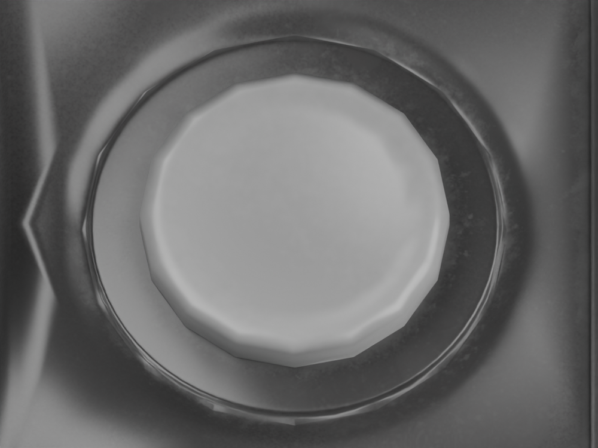
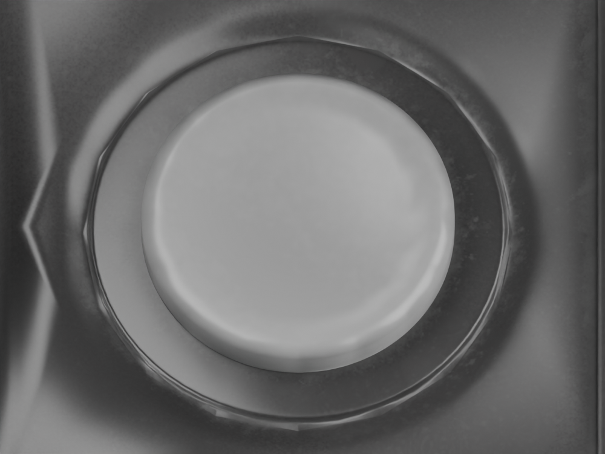

# Rounded circle pad

Active files: `model/candidates/joshua-xl/silver-pad.blend` and adjacent `.glb`, mirrored to the public model. Export SHA-256: `8e79f528aa3dd90e1a2a73af9001b6ce7713695203f9d1a99293f805b95f21e6`. The preceding `silver-chassis` checkpoint is preserved.

The source pad had a sixteen-sided perimeter, visibly unlike the circular pad in the [original-XL front reference](https://cdn.mos.cms.futurecdn.net/0584727e6f39c0e334d6e9537772f9fa.jpg). The reference was inspected again in this pass. It establishes the round outline, not an exact rubber profile or factory radius.

`scripts/round_sourced_circle_pad.py` starts only from `silver-chassis.blend`. It subdivides the original pad and maps its outer polygonal rings to circular ones, fading the change between radii 4.8 and 5.45 mm. The centre, maximum radius, stem and vertical coordinates are retained. UVs and transported shading frames retain the existing texture maps. Maximum movement is 0.149325 mm; triangle count rises from 192 to 8,064. See `pad-smoothing-report.json` in the candidate directory.

The close-ups share an orthographic camera at `(−62, −40, 140)`, aimed at `(−62, 15, 14)`, scale 30 mm and hinge 155°. All six whole-console after views were also rendered and inspected as `pad-after-{front,open,top,side,rear,underside}.png`, matching the preceding chassis views. The pad outline is smoother; the socket is still the previous source geometry.

## Verification

All 62 tests pass. Three new pad checks cover exact preservation of all other meshes, transforms, materials and images; closed 156 × 93 × 22 mm dimensions; retained stem vertices; valid shading frames; maximum pad radius and height; and upward rays from the new top rim into the actual exported closed inner lid. The sampled minimum clearance stays between 0.015 and 0.018 mm, consistent with the prior 0.01676 mm measurement.

In the browser at 1280 × 720, the pad appears round and its right side correctly sends `right`, moving the selected folder from index 0 to 2. VGPU reports ready and no warnings/errors were captured. The temporary viewport override was reset. Blender is left on the accepted `silver-pad.blend`.

## Rejected socket experiment

`scripts/round_sourced_pad_recess.py` starts from `silver-pad.blend` and produces a separate `silver-socket` trial. It is **not** the live model. The trial subdivides the recess and rounds its local rings, but the retained source shading and outer transition still produce an uneven rim highlight.

- [Transported-frame trial](../model/candidates/joshua-xl/socket-frame-trial-pad.png): the highlight becomes wavy.
- [Interpolated source frames](../model/candidates/joshua-xl/socket-after-pad.png): retaining the original smooth frames does not remove the unevenness.
- [Normal-map-disabled diagnostic](../model/candidates/joshua-xl/socket-no-normal-pad.png): the raised normal-map highlight is reduced, but the outer contour/transition still has irregularities. The normal map was disabled only on a temporary material copy and restored afterwards.

Rejected binaries and whole-console trial renders are preserved under `.local/circle-pad-socket-trial/`; the script and close-up evidence remain available for reproduction. The socket needs a coordinated surface-profile and shading correction, not repeated radial warping alone. The trial report is retained as `socket-smoothing-report.json` and is not acceptance evidence.

Exact pad material/profile, socket appearance, other fine hardware details, lettering and authentic HOME Menu assets remain unfinished requirements.
