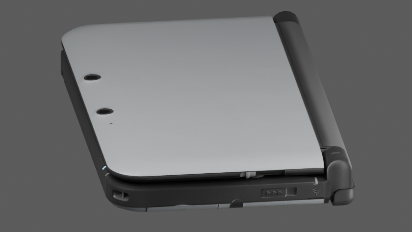
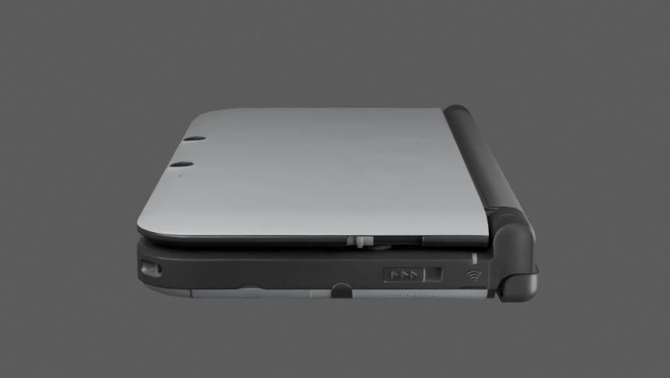

# Closed side seam and paint-boundary audit

The flat orthographic side render made the closed seam and silver lower-cover band appear excessive. That was a hypothesis, not a confirmed hardware mismatch. An additional photographic comparison does not support lowering the complete lid or darkening the lower cover.

## References inspected

The [TechRadar original-XL review](https://www.techradar.com/reviews/gaming/handheld-consoles/nintendo-3ds-xl-1089176/review) includes three useful photographs:

- [Closed front/top](https://cdn.mos.cms.futurecdn.net/d37ab2394c9d8ae506417b7045df14fb.jpg).
- [Closed right side](https://cdn.mos.cms.futurecdn.net/2d5df0aef6b8b10de736daf00d973360.jpg): the 3D slider, wireless slider and stylus side match the model's right-side view.
- [Closed left side](https://cdn.mos.cms.futurecdn.net/cbef826a4953662e93d9a4a6a5274862.jpg): the volume-slider side provides an independent view of the dark seam.

The downloaded images are 420 × 237 pixels, stored for reference under `.local/references/side/techradar-{241,242,243}.jpg`. Their limited resolution and uncalibrated cameras preclude a precise gap measurement. The article's textual dimension error is not used; Nintendo's published dimensions remain authoritative.

SHA-256, in the same order: `e7f46c4ab1a34297a59dab0d2f38acaefb844b9c9a87ab843033a1e62b236abd`, `0fdc18dca447b35ba1d1b5f7eee4236e035c9a8e5d3d2f6522f7a022f489910e`, `29ec61ed95bb631e522b3ad76526acb0b526c36b0fba0ee98ab844f855e9dac2`.

The existing underside photograph, `.local/references/eur/konsolen-chips-underside.jpg` (provenance in `source-eur-validation.md`), shows silver paint continuing around the rolled lower-cover edge. It does not support replacing that complete edge with black plastic.

## Controlled model comparison

`scripts/render_sourced_side_audit.py` renders the preserved `silver-corners.blend` with the lid closed. It first uses a raised orthographic side view, then a perspective view from native `(380, 0, 100)` mm aimed at `(0, 0, 11)` mm, with a 75 mm lens. This approximates the photographic view; it is not a calibrated camera solve. The shared renderer now accepts an optional perspective lens and restores camera type, lens and all existing settings afterwards.

The photographic and perspective-render views both show a dark horizontal separation below the lid's dark trim and a thin visible silver lower edge. The broad silver band in the earlier flat side render becomes thin at the raised angle without changing any materials. Lighting also changes its apparent brightness. These observations weaken the proposed seam/paint corrections; they do not prove an exact gap, curvature or reflectance match.

No geometry, textures, public GLB or saved Blender checkpoint were changed by this audit. In particular, lowering the whole lid would need to overcome the independently measured 0.01676 mm circle-pad clearance documented in `source-dimensions-validation.md`.

## Next modeling priority

Do not treat the dark seam alone as a defect or blacken the silver lower cover based on the flat side render. Continue with the visibly segmented lower-cover corner contour, comparing that geometry against the underside photograph and physical scan. Hardware glyphs, material fidelity and HOME Menu assets remain separate unresolved requirements.
